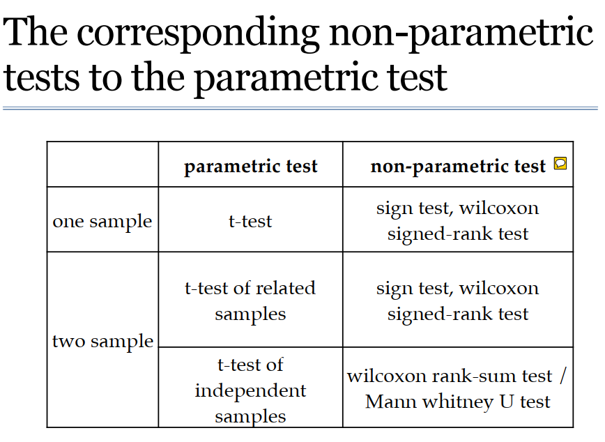
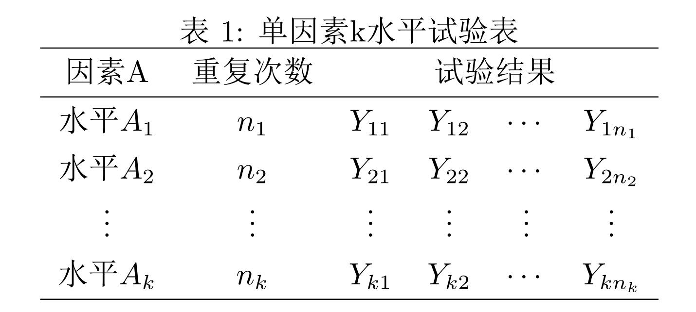
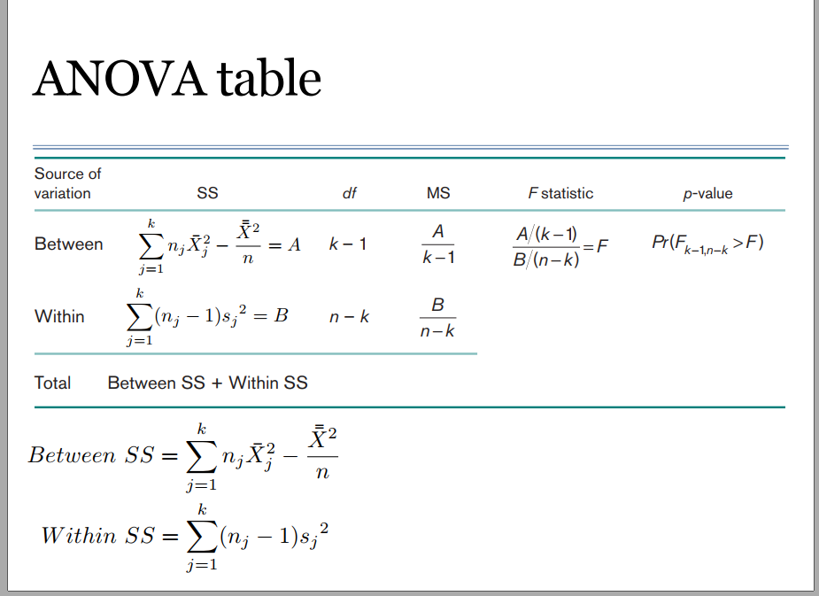

## 统计检验与多重矫正

#### 1.统计检验

假设检验(hypothesis testing)，又称统计假设检验，是用来判断样本与样本、样本与总体的差异是由抽样误差引起还是本质差别造成的统计推断方法。

主要讲一下 μ检验（又称Z检验），T检验、F检验的原理以及在R中的应用。

##### 1.1  Z 检验 T检验

参考：https://zhuanlan.zhihu.com/p/51502814

#####  T检验

亦称student t检验（Student's t test），主要用于样本含量较小（例如n < 30），总体标准差σ未知的正态分布。T检验是用t分布理论来推论差异发生的概率，从而比较两个平均数的差异是否显著。简单来讲就是通过比较两个均值看是否有差异。

#####  Z检验

Z检验是一般用于大样本(即样本容量大于30)平均值差异性检验的方法。它是用标准正态分布的理论来推断差异发生的概率，从而比较两个平均数的差异是否显著。

###### 1.1.2 单样本的检验

总体方差已知的，无论是大样本还是小样本，样本服从正态分布，标准化后服从标准正态分布，用z检验。

总体方差未知时，但是n>=30，用Z检验；n<30,用T检验。

T检验：已知一个总体均数；可得到一个样本均数及该样本标准差；样本来自正态或近似正态总体。

###### 单样本的T检验在R中的应用

```R
某鱼塘水的含氧量多年平均值为4.5mg/L,现在该鱼塘设10点采集水样，测定水中含氧量（单位：mg/L）分别为：
#4.33,4.62,3.89,4.14,4.78,4.64,4.52,4.55,4.48,4.26，问该次抽样的水中含氧量与多年平均值是否有显著差异？
Sites<-c(4.33,4.62,3.89,4.14,4.78,4.64,4.52,4.55,4.48,4.26)
t.test(sites,mu=4.5)###双边检验
One Sample t-test

data:  Sites
t = -0.93574, df = 9, p-value = 0.3738
alternative hypothesis: true mean is not equal to 4.5
95 percent confidence interval:
 4.230016 4.611984
sample estimates:
mean of x 
    4.421 

t.test(Sites,mu=4.5,alternative = "greater")##单边检验

	One Sample t-test

data:  Sites
t = -0.93574, df = 9, p-value = 0.8131
alternative hypothesis: true mean is greater than 4.5
95 percent confidence interval:
 4.266239      Inf
sample estimates:
mean of x 
    4.421 

 t.test(Sites,mu=4.5,alternative = "less")

	One Sample t-test

data:  Sites
t = -0.93574, df = 9, p-value = 0.1869
alternative hypothesis: true mean is less than 4.5
95 percent confidence interval:
     -Inf 4.575761
sample estimates:
mean of x 
    4.421 
```

###### 1.1.3 两个样本的检验

总体方差已知，不论样本容量是否大于30，用z检验

总体方差未知，两样本容量均大于30，用z检验；两样本容量小于30时，用T检验

###### 两样本T检验在R的应用

```R
—————————#独立样本T检验#——————————————
#有两种情况，一种是两个总体方差齐性，另一种是两个总体方差不齐。
#方差齐性时直接使用独立样本T检验，当两样本方差不齐时，使用t′检验，t′检验用于两组间方差不齐时，t′检验的计算公式实际上是方差不齐时t检验的校正公式。

#################两样本方差齐性
#用高蛋白和低蛋白两种饲料饲养1月龄的大白鼠，饲养3个月后，测定两组大白鼠的增重量(g)，两组数据分别如下所示：
#高蛋白组：134,146,106,119,124,161,107,83,113,129,97,123
#低蛋白组：70,118,101,85,107,132,94
#试问两种饲料养殖的大白鼠增重量是否有显著差异？
High<-c(134,146,106,119,124,161,107,83,113,129,97,123)
Low<-c(70,118,101,85,107,132,94)
Group<-c(rep(1,12),rep(0,7))#1表示High，0表示Low
x<-c(High,Low)
DATA<-data.frame(x,Group)
DATA$Group<-as.factor(DATA$Group)
#bartlett.test方差齐性检验
bartlett.test(x~Group)
        Bartlett test of homogeneity of variances

data:  x by Group
Bartlett's K-squared = 0.0066764, df = 1, p-value = 0.9349

#var.test方差齐性检验
var.test(x~Group)
 F test to compare two variances

data:  x by Group
F = 0.94107, num df = 6, denom df = 11, p-value = 0.9917
alternative hypothesis: true ratio of variances is not equal to 1
95 percent confidence interval:
 0.2425021 5.0909424
sample estimates:
ratio of variances 
          0.941066 

#leveneTest方差齐性检验（也是SPSS的默认方差齐性检验方法）
library(car)
leveneTest(DATA$x,DATA$Group)
Levene's Test for Homogeneity of Variance (center = median)
      Df F value Pr(>F)
group  1  0.0088 0.9264
      17              
#前两者是对原始数据的方差进行检验的，leveneTest是对方差模型的残差进行组间齐性检验.一般认为是要求残差的方差齐，所以一般的统计软件都做的是leveneTest
#结果说明两独立样本数据方差齐性，可以进行独立样本T检验。
>t.test(High,Low,paired=FALSE)
        Welch Two Sample t-test

data:  High and Low
t = 1.9319, df = 13.016, p-value = 0.07543
alternative hypothesis: true difference in means is not equal to 0
95 percent confidence interval:
 -2.263671 40.597005
sample estimates:
mean of x mean of y 
 120.1667  101.0000 
结果表明两种饲料养殖的大白鼠增重量无显著差异。

#################两样本方差不齐######
##  t′检验用于两组间方差不齐时，t′检验的计算公式实际上是方差不齐时t检验的校正公式。

#有人测定了甲乙两地区某种饲料的含铁量（mg/kg），结果如下：
#甲地：5.9,3.8,6.5,18.3,18.2,16.1,7.6
#乙地：7.5,0.5,1.1,3.2,6.5,4.1,4.7
#试问这种饲料含铁量在两地间是否有显著差异？
JIA<-c(5.9,3.8,6.5,18.3,18.2,16.1,7.6)
YI<-c(7.5,0.5,1.1,3.2,6.5,4.1,4.7)
Content<-c(JIA,YI)
Group<-c(rep(1,7),rep(2,7))#1表示甲地，2表示乙地
data<-data.frame(Content,Group)
data$Group<-as.factor(Group)

#bartlett.test方差齐性检验
bartlett.test(Content~Group)
 Bartlett test of homogeneity of variances

data:  Content by Group
Bartlett's K-squared = 3.9382, df = 1, p-value = 0.0472

#var.test方差齐性检验
var.test(Content~Group)
 F test to compare two variances

data:  Content by Group
F = 5.9773, num df = 6, denom df = 6, p-value = 0.04695
alternative hypothesis: true ratio of variances is not equal to 1
95 percent confidence interval:
  1.02707 34.78643
sample estimates:
ratio of variances 
            5.9773 

#leveneTest方差齐性检验（也是SPSS的默认方差齐性检验方法）
library(car)
leveneTest(data$Content,data$Group)
Levene's Test for Homogeneity of Variance (center = median)
      Df F value Pr(>F)
group  1   3.073 0.1051
      12  
#结果说明两独立样本数据方差不齐，对齐进行方差不齐分析
t.test(Content,Group,paired=FALSE,var.equal=FALSE)
Welch Two Sample t-test

data:  Content and Group
t = 3.7511, df = 13.202, p-value = 0.002362
alternative hypothesis: true difference in means is not equal to 0
95 percent confidence interval:
 2.519419 9.337724
sample estimates:
mean of x mean of y 
 7.428571  1.500000 
#方差齐性检验表明，方差不等，因此设定var.equal=FALSE，此时p=0.0023<0.05，
#表明该饲料在两地的含铁量有显著差异。

—————————#配对样本T检验#——————————————
常用的配对设计：
同一受试对象处理前后的数据
同一受试对象两个部位的数据
同一样本用两种方法检验得结果
配对的两个受视对象分别接受两种处理的结果
#某人研究冲水对草鱼产卵率的影响， 获得冲水前后草鱼产卵率（%），如下：
#冲水前：82.5,85.2,87.6,89.9,89.4,90.1,87.8,87.0,88.5,92.4
#冲水后：91.7,94.2,93.3,97.0,96.4,91.5,97.2,96.2,98.5,95.8
#问：冲水前后草鱼亲鱼产卵率有无差异？
Before<-c(82.5,85.2,87.6,89.9,89.4,90.1,87.8,87.0,88.5,92.4)
After<-c(91.7,94.2,93.3,97.0,96.4,91.5,97.2,96.2,98.5,95.8)
t.test(Before,After,paired=T)
        Paired t-test

data:  Before and After
t = -7.8601, df = 9, p-value = 2.548e-05
alternative hypothesis: true difference in means is not equal to 0
95 percent confidence interval:
 -9.1949 -5.0851
sample estimates:
mean of the differences 
                  -7.14 
结果表明，p=2.548e-05<0.01，表明冲水前后，草鱼亲鱼的产卵率有非常显著差异。
```

上面的检验方法都是参数检验，已知样本的方差或者分布的检验，对于样本方差或者分布不清楚的检验需要用另外的检验方法，下面的图总结了使用情况



对于非参数检验在R 中的应用

```R
> JIA<-c(5.9,3.8,6.5,18.3,18.2,16.1,7.6)
> YI<-c(7.5,0.5,1.1,3.2,6.5,4.1,4.7)
> wilcox.test(JIA,YI,paired = T)

	Wilcoxon signed rank test

data:  JIA and YI
V = 27, p-value = 0.03125
alternative hypothesis: true location shift is not equal to 0
#### https://www.cnblogs.com/djx571/p/10216940.html 具体计算过程
```

##### 1.2 F检验

F检验又叫方差齐性检验。在两样本t检验中要用到F检验。应用于两个样本的方差的检验。

F检验、Bartlett卡方检验对资料**正态性**要求苛刻，Leven检验可用于**任意分布**资料，是一种较为**稳健**的方差齐性检验方法。

##### 1.3 方差分析

对于多个样本来说，不适用于z检验、t检验，用方差分析来比较多个样本均数。方差分析的统计量是方差，所以也称之为F检验。

###### 单因素方差分析

资料来源：https://zhuanlan.zhihu.com/p/33357167



顾名思义，只考虑一个因素A对于所关心的试验结果的影响。A 取k 个水平，在每个水平上作 ![[公式]](https://www.zhihu.com/equation?tex=n_i) 次试验（其中![[公式]](https://www.zhihu.com/equation?tex=i%3D1%2C2%2C%5Ccdots%2Ck) 。）试验过程中除A 外其它影响试验结果的因素都保持不变（只有随机因素存在）。我们的任务是从试验结果推断，因素A 对试验结果有无显著影响，即当A 取不同水平时试验结果有无显著差别。其中 ![[公式]](https://www.zhihu.com/equation?tex=u%3D%5Cfrac%7B1%7D%7Bk%7D%2A%5Csum_%7Bi%3D1%7D%5E%7Bk%7Da_%7B0i%7D) ,为总均值， ![[公式]](https://www.zhihu.com/equation?tex=a_%7Bi%7D%3Da_%7B0i%7D-u) 表示因素A的第i个水平的附加效应（和平均值比的差距）。

因素A的各个水平的优劣取决于 ![[公式]](https://www.zhihu.com/equation?tex=a_i) 的大小，如果 ![[公式]](https://www.zhihu.com/equation?tex=a_1%3Da_1%3D%5Ccdots%3Da_k%3D0) ，则表示因素A对于试验结果Y毫无影响。这是我们就说因素A的效应不显著。在实际应用中，所谓“显著”,是指 ![[公式]](https://www.zhihu.com/equation?tex=a_i) 之间的差异要大到“一定的程度”（其实是指与随机误差相比）。

我们把所要检验的假设写为： ![[公式]](https://www.zhihu.com/equation?tex=%5C%5CH_0%3Da_1%3Da_2%3D%5Ccdots%3Da_k%3D0)

为了检验上述假设，我们做出下面的分析，为什么实际上各个 ![[公式]](https://www.zhihu.com/equation?tex=Y_%7Bij%7D) 的值会有差异？从统计模型上看，不外乎两个原因：一是各个水平可能有差异，例如 ![[公式]](https://www.zhihu.com/equation?tex=A_1) 水平可能远远优于 ![[公式]](https://www.zhihu.com/equation?tex=A_2) ，这就使得 ![[公式]](https://www.zhihu.com/equation?tex=Y_%7B1j%7D) 很可能大于 ![[公式]](https://www.zhihu.com/equation?tex=Y_%7B2j%7D) ；二是随机误差的存在。

先找一个衡量全部 ![[公式]](https://www.zhihu.com/equation?tex=Y_%7Bij%7D) 变异的量，它自然而然地取为了：![[公式]](https://www.zhihu.com/equation?tex=%5C%5CSS%3D%5Csum_%7Bi%3D1%7D%5Ek%5Csum_%7Bj%3D1%7D%5E%7Bn_i%7D%28Y_%7Bij%7D-%5Coverline%7BY%7D%29%5E2) ，其中 ![[公式]](https://www.zhihu.com/equation?tex=%5Coverline%7BY%7D%3D%5Cfrac%7B1%7D%7Bn%7D%5Csum_%7Bi%3D1%7D%5Ek%5Csum_%7Bj%3D1%7D%5E%7Bn_i%7DY_%7Bij%7D) ， ![[公式]](https://www.zhihu.com/equation?tex=n%3Dn_1%2B%5Ccdots%2Bn_k) 。

SS又被称为总偏差平方和，SS越大，表示 ![[公式]](https://www.zhihu.com/equation?tex=Y_%7Bij%7D) 之间的差异越大。根据上面的分析，设法把把SS分解为两部分，一部分表示随机误差的影响，记为 ![[公式]](https://www.zhihu.com/equation?tex=SS_e) ，又被称为组内偏差；另一部分表示因素A的各水平之间的差异带来的影响，记为 ![[公式]](https://www.zhihu.com/equation?tex=SS_A) ，又被称为组间偏差。

先考虑 ![[公式]](https://www.zhihu.com/equation?tex=SS_e) 的部分，第i个水平的 ![[公式]](https://www.zhihu.com/equation?tex=n_i) 次试验结果依次为 ![[公式]](https://www.zhihu.com/equation?tex=Y_%7Bi1%7D%2CY_%7Bi2%7D%2C%5Ccdots%2CY_%7Bin_%7Bi%7D%7D) 。它们之间的差异和因素A的各个水平完全无关，只和随机误差相关。

衡量第i个水平的 ![[公式]](https://www.zhihu.com/equation?tex=n_i) 次试验结果的差异程度的量是 ![[公式]](https://www.zhihu.com/equation?tex=%5Csum_%7Bj%3D1%7D%5E%7Bn_i%7D%28Y_%7Bij%7D-%5Coverline%7BY_i%7D%29%5E2) ，其中 ![[公式]](https://www.zhihu.com/equation?tex=%5Coverline%7BY_i%7D%3D%5Cfrac%7B1%7D%7Bn%7D%28Y_%7Bi1%7D%2BY_%7Bi2%7D%2B%5Ccdots%2BY_%7Bin_%7Bi%7D%7D%29) ，![[公式]](https://www.zhihu.com/equation?tex=i%3D1%2C2%2C%5Ccdots%2Ck) 。 ![[公式]](https://www.zhihu.com/equation?tex=%5Coverline%7BY_i%7D) 是第i个水平的试验结果的算术平均，将所有的k个水平的平方和相加，可得： ![[公式]](https://www.zhihu.com/equation?tex=%5C%5CSS_e%3D%5Csum_%7Bi%3D1%7D%5E%7Bk%7D%5Csum_%7Bj%3D1%7D%5E%7Bn_i%7D%28Y_%7Bij%7D-%5Coverline%7BY_i%7D%29%5E2)

我们将SS和 ![[公式]](https://www.zhihu.com/equation?tex=SS_e) 相减看看会得到什么，应该就是 ![[公式]](https://www.zhihu.com/equation?tex=SS_A) 吧。可以得到![[公式]](https://www.zhihu.com/equation?tex=%5C%5CSS_A%3DSS-SS_e%5C%5C%3D%5Csum_%7Bi%3D1%7D%5E%7Bk%7Dn_i%28%5Coverline%7BY_i%7D-%5Coverline%7BY%7D%29%5E2)

从 ![[公式]](https://www.zhihu.com/equation?tex=SS_A) 的表达式可以看出，它是衡量因素A的不同水平间的差异的平方和。

为了将 ![[公式]](https://www.zhihu.com/equation?tex=SS%3DSS_A%2BSS_e) 看得更清晰，这里可以利用一个小技巧。 令![[公式]](https://www.zhihu.com/equation?tex=%28Y_%7Bij%7D-%5Coverline%7BY%7D%29%3D%28Y_%7Bij%7D-%5Coverline%7BY_i%7D%29%2B%28%5Coverline%7BY_i%7D-%5Coverline%7BY%7D%29) 。 两边平方，先固定i对j进行求和，注意到： ![[公式]](https://www.zhihu.com/equation?tex=%5Csum_%7Bj%3D1%7D%5E%7Bn_i%7D%28Y_%7Bij%7D-%5Coverline%7BY_i%7D%29%28%5Coverline%7BY_i%7D-%5Coverline%7BY%7D%29%5C%5C%3D%28%5Coverline%7BY_i%7D-%5Coverline%7BY%7D%29%5Csum_%7Bj%3D1%7D%5E%7Bn_i%7D%28Y_%7Bij%7D-%5Coverline%7BY_i%7D%29%3D0) 再对i进行求和即可得到 ![[公式]](https://www.zhihu.com/equation?tex=SS%3DSS_A%2BSS_e) 。

引出了总偏差平方和SS，因素A的平方和 ![[公式]](https://www.zhihu.com/equation?tex=SS_A) 和误差平方和 ![[公式]](https://www.zhihu.com/equation?tex=SS_e) ，**我们就可以得知方差分析的名称由来。是因为这三个表达式都是属于样本方差一类的形状。**

若记 ![[公式]](https://www.zhihu.com/equation?tex=%5C%5CMS_A%3D%5Cfrac%7BSS_A%7D%7B%28k-1%29%7D%2CMS_e%3D%5Cfrac%7BSS_e%7D%7B%28n-k%29%7D) ，其分别表示因素A 和随机误差的平均平方和，分母k-1和n-k分别为这两个平方和的自由度。基于前面的独立同正态分布和方差齐性的假设，当原假设![[公式]](https://www.zhihu.com/equation?tex=H_0) 成立时，可以证明： ![[公式]](https://www.zhihu.com/equation?tex=%5C%5C%5Cfrac%7BMS_A%7D%7BMS_e%7D%5Csim+F_%7Bk-1%2Cn-k%7D)

此即对应于F分布的F检验，当![[公式]](https://www.zhihu.com/equation?tex=%5Cfrac%7BMS_A%7D%7BMS_e%7D%5Cle+F_%7Bk-1%2Cn-k%7D%28%5Calpha%29) 时，其中 ![[公式]](https://www.zhihu.com/equation?tex=%5Calpha) 为显著性水平，接受原假设 ![[公式]](https://www.zhihu.com/equation?tex=H_0) ，反之，拒绝原假设 ![[公式]](https://www.zhihu.com/equation?tex=H_0) 。




###### 方差分析在R中的应用

~~~R
>medicine <- data.frame(
  Response=c(30,38,35,41,27,24,32,26,31,29,27,35,21,25,17,21,20,19),
  Treatment=factor(c(rep("a",6),rep("b",8),rep("c",4)))
)  
> attach(medicine)
> shapiro.test(Response[Treatment=="a"])

	Shapiro-Wilk normality test

data:  Response[Treatment == "a"]
W = 0.96129, p-value = 0.8296

> shapiro.test(Response[Treatment=="b"])

	Shapiro-Wilk normality test

data:  Response[Treatment == "b"]
W = 0.99106, p-value = 0.9965
 
> shapiro.test(Response[Treatment=="c"])

	Shapiro-Wilk normality test

data:  Response[Treatment == "c"]
W = 0.97137, p-value = 0.85
###############################三组数据p值大于0.05，拒绝原假设，样本分布为正态分布
> bartlett.test(Response~Treatment,data=medicine)

	Bartlett test of homogeneity of variances

data:  Response by Treatment
Bartlett's K-squared = 4.4546, df = 2, p-value = 0.1078

> a.aov <- aov(Response~Treatment,data = medicine)
# 查看单因素方差分析结果，结果为拒绝原假设，各水平的均值并不完全相等，存在显著差异。
> summary(a.aov)
            Df Sum Sq Mean Sq F value  Pr(>F)   
Treatment    2  426.2  213.12   8.789 0.00298 **
Residuals   15  363.8   24.25                   
---
Signif. codes:  0 ‘***’ 0.001 ‘**’ 0.01 ‘*’ 0.05 ‘.’ 0.1 ‘ ’ 1

> # 多重比较
> TukeyHSD(a.aov)
  Tukey multiple comparisons of means
    95% family-wise confidence level

Fit: aov(formula = Response ~ Treatment, data = medicine)

$Treatment
      diff       lwr       upr     p adj
b-a  -4.25 -11.15796  2.657961 0.2768132
c-a -13.25 -21.50659 -4.993408 0.0022342
c-b  -9.00 -16.83289 -1.167109 0.0237003
#####可以看出a,b两水平数据是存在显著差异的，因为他们的P值大于0.05.
~~~

###### 多因素的方差分析

~~~R
> library(multcomp)
> data(litter)
> dim(litter)
[1] 74  4
> 
> head(litter)
  dose weight gesttime number
1    0  28.05     22.5     15
2    0  33.33     22.5     14
3    0  36.37     22.0     14
4    0  35.52     22.0     13
5    0  36.77     21.5     15
6    0  29.60     23.0      5
> bartlett.test(weight~as.factor(gesttime),data=litter)

  Bartlett test of homogeneity of variances

data:  weight by as.factor(gesttime)
Bartlett's K-squared = 0.26778, df = 3, p-value = 0.966

> bartlett.test(weight~dose,data=litter)

  Bartlett test of homogeneity of variances

data:  weight by dose
Bartlett's K-squared = 9.6497, df = 3, p-value = 0.02179

####输出结果显示：变量gesttime的值为0.966，大于给定的显著性水平0.05，故不能拒绝原假设，即认为不同水平下是等方差的，然而dose的p值为0.02179，没有通过检验。接下来对数据进行方差分析，分别按照不考虑gesttime和dose的交互和考虑其交互进行分析。

> fit1<-aov(weight~gesttime+dose,data=litter)
> summary(fit1)
            Df Sum Sq Mean Sq F value  Pr(>F)   
gesttime     1  134.3  134.30   8.049 0.00597 **
dose         3  137.1   45.71   2.739 0.04988 * 
Residuals   69 1151.3   16.69                   
---
Signif. codes:  0 ‘***’ 0.001 ‘**’ 0.01 ‘*’ 0.05 ‘.’ 0.1 ‘ ’ 1
在不考虑交互作用的情况下，协变量gesttime和dose的检验p值均小于给定的显著水平，故拒绝原假设，即认为变量gesttime和dose对变量weight的影响均显著的。

> fit2<-aov(weight~gesttime*dose,data=litter)
> summary(fit2)
              Df Sum Sq Mean Sq F value  Pr(>F)   
gesttime       1  134.3  134.30   8.289 0.00537 **
dose           3  137.1   45.71   2.821 0.04556 * 
gesttime:dose  3   81.9   27.29   1.684 0.17889   
Residuals     66 1069.4   16.20                   
---
Signif. codes:  0 ‘***’ 0.001 ‘**’ 0.01 ‘*’ 0.05 ‘.’ 0.1 ‘ ’ 1
上述代码表示:在考虑交互作用的情况下进行方差分析，结果显示，交互作用项的p值为0.17889，大于给定的显著性水平0.05,故不认为交互项对交量weigh的影响是显著的，该交互项可以删除。
~~~

##### 如果数据不满足方差齐性，则推荐使用Welch’s anova  

~~~
> oneway.test(weight~dose,data=litter)

	One-way analysis of means (not assuming equal variances)

data:  weight and dose
F = 3.0575, num df = 3.000, denom df = 36.373, p-value = 0.04041
~~~

##### 若数据的总体分布类型未知；或数据的总体分布类型已知，但不符合正态分布；或某些变量可能无法精确测量时，可以使用非参数统计方法.秩和检验是非参数统计中一种经常使用的检验方法。这里的“秩”即按照数据大小排定的次序号。此次序号的总和被称为“秩和”。

```R
> medicine <- data.frame(
     Response=c(7,5,3,1,6,5,3,3,7,9,9,9,4,3,4,3),
     Treatment=factor(c(rep(1,4),rep(2,4),rep(3,4),rep(4,4))))  
> kruskal.test(Response~Treatment,data=medicine)

	Kruskal-Wallis rank sum test

data:  Response by Treatment
Kruskal-Wallis chi-squared = 8.6428, df = 3, p-value = 0.03444
```

### 检验矫正

参考资料https://zhuanlan.zhihu.com/p/51546651

对于多重假设检验得到的P值需要进行校正。因为P值的阈值是人为规定的，无论是多小的P值，也仅仅能代表结果的低假阳性，而非保证结果为真。即使P值已经很小（比如0.05），也会被检验的总次数无限放大。比如检验10000次，得到假阳性结果的次数就会达到 5%*10000=500次。

```R
##R中提供的检验矫正的方法
> p.adjust.methods
[1] "holm"       "hochberg"   "hommel"     "bonferroni" "BH"         "BY"         "fdr"       
[8] "none"
```

主要使用的校正办法有两种：

##### 1.Bonferroni 校正

Bonferroni 校正法可以称作是“最简单粗暴有效”的校正方法，它拒绝了所有的假阳性结果发生的可能性，通过对p值的阈值进行校正来实现消除假阳性结果。

Bonferroni 校正的公式为p*(1/n)，其中p为原始阈值，n为总检验次数。

如果像我们举的例子一样，原始的P值为0.05，检验次数为10000次，那么在Bonferroni 校正中，校正的阈值就等于5%/ 10000 = 0.000005，所有P值超过0.00005的结果都被认为是不可靠的。这样的话假阳性结果在10000次检验中出现的次数为 10000 * 0.000005 =0.5，还不到1次。

但是这也存在问题：Bonferroni 委实太过严格，被校正后的阈值拒绝的不只有假阳性结果，很多阳性结果也会被它拒绝。


##### 2 . FDR（FalseDiscovery Rate） 校正

相对Bonferroni 来说，FDR温和得多，这种校正方法不追求完全没有假阳性结果，而是将假阳性结果和真阳性的比例控制在一定范围内。

举个例子，我们最开始设定的情况中进行了10000次检验，这次我们设定FDR<0.05，如果我们的检验对象为差异表达的基因，那么在10000次检验中假如得到了500个基因，那么这500个基因中的假阳性结果小于 500*5% = 25 个。

FDR的计算方法有很多种，这里介绍一个比较常用的：

**BH（Benjaminiand Hochberg）法：**

BH 法需要将总计m次检验的结果按由小到大进行排序，k为其中一次检验结果的P值所对应的排名。

找到符合原始阈值α的最大的k值，满足P(k)<=α*k/m，认为排名从1到k的所有检验存在显著差异，并计算对应的q值公式为q = p*(m/k)。

举个例子，如果我们有总共六个结果进行FDR校正：


按α=0.05进行计算：

排名第四的 P (4) = 0.03 < 0.05*4/6 = 0.033，符合要求

排名第五的 P (5)= 0.045 > 0.05*5/6 = 0.041，不满足P(k)<=α*k/m，因此在这个列表里排名前四的G2,G6,G5,G4 为具有显著差异的基因。

我们也可以用q值进行FDR校正：


排名第五的G3，其q值大于0.05，故G2,G6,G5,G4 为具有显著差异的基因。