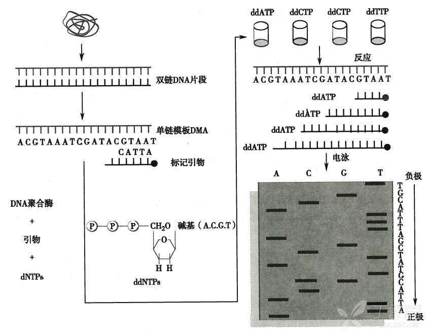
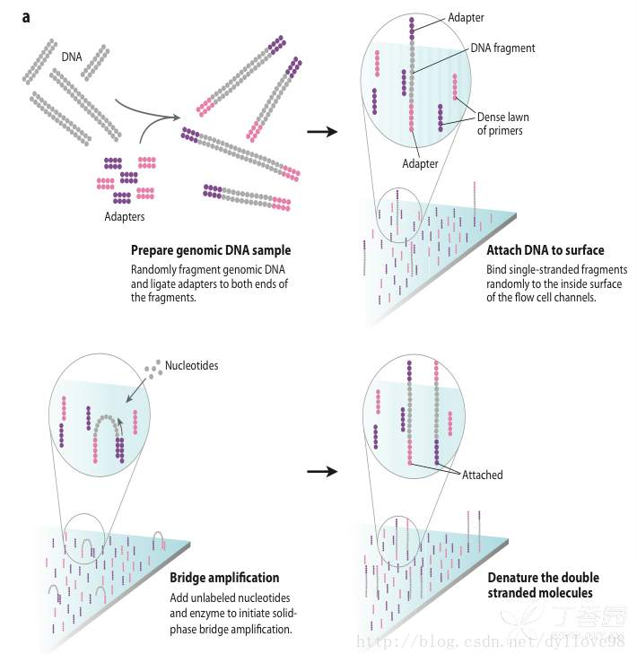
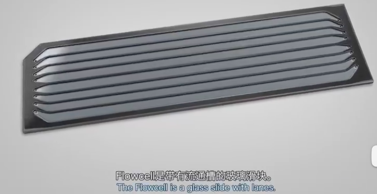
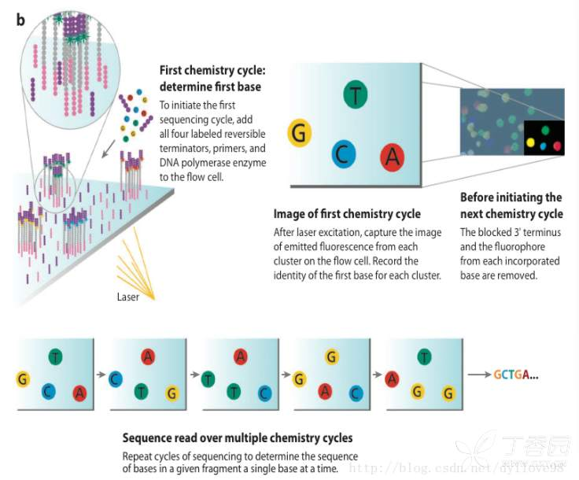
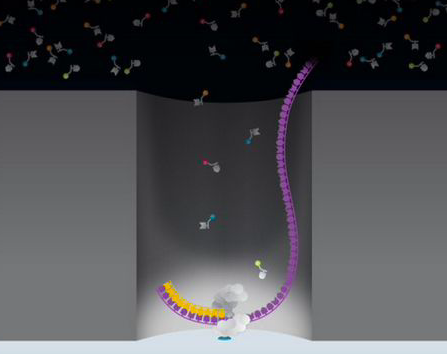
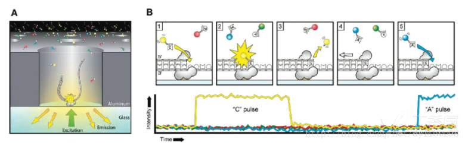
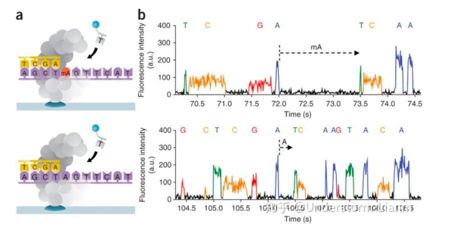

* **一代测序 ：Sanger的链终止法**

在DNA合成时，相邻的脱氧核糖核酸之间会形成牢固的磷酸二酯键，双链合成的反应得以延续。然而如果在DNA双链合成过程中，掺入ddNTP之后，由于ddNTP的2’和3’端都不含有羟基，那么在合成DNA链的过程中另一端就无法形成磷酸二酯键，最终导致链的合成被终止。
我们可以通过在一个反应中只加入一种ddNTP，（如ddATP）那么所合成片段终止的最后一个碱基序列就是A。最终通过四组添加不同ddNTP的反应，我们可以合成起始位置相同并且最后一个碱基已知的不同长度的DNA片段，通过电泳技术将其分离后依次读取整个的序列信息。
在实际研究中为了方便会在四种双脱氧核糖核酸上添加不同颜色的发光基团，可以实现在将他们同时添加到一个体系之后进行分离。
具体的分离过程是在毛细管正极一端用激光进行照射，并用分光的光学传感器把不同颜色的荧光强度记录下来。越先到达毛细管正极的DNA片段越短，它聚合的终止位置离聚合起始位置越近，因此它的颜色就反映了离3’末端最近的碱基的种类。然后我们就会得到峰值图，图的横轴代表电泳时间，纵轴代表荧光强度，然后我们可以根据峰的颜色判断出依次是哪种碱基。峰越高越尖说明这个碱基的判读越准确。从而读取序列信息。

* <u>**第二代测序**</u>是对传统Sanger测序技术革命性的变革，可以一次对几十万到几百万条核酸分子进行序列测定，因此也称其为下一代测序技术 (Next Generation Sequencing, NGS)，高通量测序技术的出现使得对一个物种的转录组和基因组进行细致全貌的分析成为可能。经过科研人员的不断开发和改进，目前成熟的第二代测序技术共有3种：illumina公司的Solexa平台；Rocha公司的454测序系统；ABI公司的SOLID&nbsp;虽有差异但基本理念都是一样，都是把大片段打成小片段之后进行测序，再通过序列信息进行组装，边合成边测序。这里以Illumina/Solexa为例，介绍一下原理。大致的流程是：建库-桥式PCR-测序

桥式PCR的流程是
1、 首先把文库加入到flowcell上，等文库和flowcell上的引物杂交完之后加入dNTP和聚合酶，就会以文库为模板合成一条新的互补链。
2、 在flowcell中加入NaOH碱溶液使DNA双链解链，然后文库那条链会被冲走，
新合成的链由于与引物连接，所以会被保留。
3、 在flowcell中加入中性液体中和碱液，使环境变为中性。这时DNA链上的另外一端会弯曲下来与另一个引物发生互补杂交。加入聚合酶和dNTP,聚合酶沿着第二个引物，合成出一条新的链。
4、 再加入碱液，使两条链解开，然后再加入中和液，两条DNA单链会和新的引物杂交互补，再加酶和dNTP，又从新的引物合成新的链。5、 连续重复第四步，DNA链的数量就会以指数方式增长。最终将信号放大，使得我们的DNA样品浓度能够达到上机的要求。
测序从第一个测序引物的延伸开始，一个循环只加一种荧光标记的dNTP，循环的次数取决于读段的长度。对于给定的簇，所有相同的片段是同时读取的。整个过程产生数百万个读段，代表文库中的所有DNA片段。最后，这些序列被分离，基于样本准备过程中添加的index，将相似的片段进行聚类，正向和反向读段被配对成连续序列，这些连续序列与参考基因组对齐，用于识别突变。

第二代测序技术的优点：一次能够同时得到大量的序列数据，相比于一代测序技术，通量提高了成千上万倍；单条序列成本非常低廉。第二代测序技术的缺点：序列读长较短，Illumina平台最长为250-300bp，454平台也只有500bp左右；由于建库中利用了PCR富集序列，因此有一些含量较少的序列可能无法被大量扩增，造成一些信息的丢失，且PCR过程中有一定概率会引入错配碱基

* <u>**第三代测序**</u>以PacBio公司的SMRT技术和Oxford Nanopore Technologies公司的纳米孔单分子技术为代表的新一代测序技术被称为第三代测序技术，与前两代测序技术相比，其最大的特点就是单分子测序，测序过程无需进行PCR扩增，并且理论上可以测定无限长度的核酸序列。

PacBio平台技术关键1.DNA聚合酶，该技术得到的序列读长主要跟DNA聚合酶的活性有关，它主要受激光对其造成的损伤所影响。2.荧光基团标记在核苷酸3'端磷酸上，在DNA合成过程中，3'端的磷酸键随着DNA链的延伸被断开，标记物被弃去，减少了DNA合成的空间位阻，维持DNA链连续合成，延长了测序读长。3.ZMW (零模波导孔)，将反应信号与周围游离碱基的强大荧光背景进行区分，在一个反应管中有许多这样的圆形纳米小孔，其外径仅有100nm，激光从底部打出后不能穿透小孔进入上方溶液区，能量被限制在一个小范围里，使得荧光信号仅来自这个小反应区域，孔外其它游离核苷酸单体依然留在黑暗中，从而实现将背景荧光降到最低。

每个ZWM孔只允许一条DNA模板进入，DNA模板进入后，DNA聚合酶与模板结合，加入4种不同颜色荧光标记4种dNTP，其通过布朗运动随机进入检测区域并与聚合酶结合从而延伸模板，与模板匹配的碱基生成化学键的时间远远长于其他碱基停留的时间，因此统计荧光信号存在时间的长短，可区分匹配的碱基与游离碱基。通过统计4种荧光信号与时间的关系，即可测定DNA模板序列。Nanopore Technologies公司的纳米孔单分子技术该技术的关键之一是，它们设计了一种特殊的纳米孔，孔内共价结合有分子接头。当DNA 碱基通过纳米孔时，它们使电荷发生变化，从而短暂地影响流过纳米孔的电流强度（每种碱基所影响的电流变化幅度是不同的），灵敏的电子设备检测到这些变化从而鉴定所通过的碱基。
它的优点是可以通过检测相邻两个碱基之间的测序时间，来检测一些碱基修饰情况，即如果碱基存在修饰，则通过聚合酶时的速度会减慢，相邻两峰之间的距离增大，可以通过这个来直接检测甲基化等信息。

视频来源：丁香园论坛https://www.dxy.cn/bbs/newweb/pc/post/43025050?keywords=一%2F二%2F三代DNA测序技术简介及视频合集