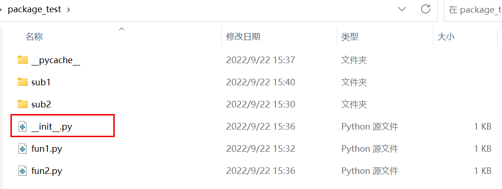
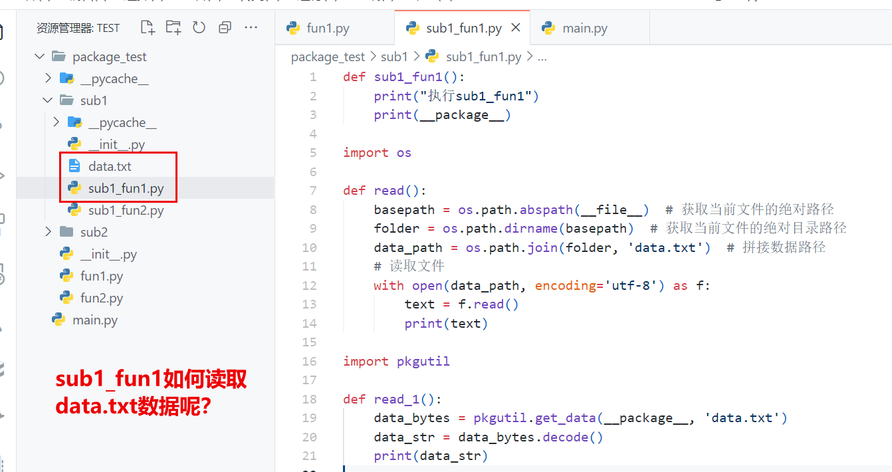

# Python包的封装及发布

# 包的构成

## 什么是Python包

包是函数、属性（变量）以及数据的集合，将多个有关联的模块组织在一起，方便使用

具体来看，包就是一个文件夹，**文件夹下必须具有__init__.py文件**；因此，具有__init__.py的文件夹就是包，包就是含有__init__.py的文件夹

​

## __init__.py文件的作用

在执行`import package_name`时，python解释器首先会执行__init__.py文件，因此我们可以在__init__.py文件中写执行用于**包的初始化**，一般不建议在__init__.py文件中执行计算代码，应仅仅把__init__.py当作一个**模块引入脚本**，如下所示：

```python
# 引入模块的中的函数
from .module1 import fun1
from .module2 import fun2

from .module3 import *  # 引入module3中的所有内容
__all__ = ["fun1", "fun2"]   # 引入限制，如有__all__，则只能引入[]中所含有的内容，否则报错

# from .module1 import fun1_1 报错
```

## 引入模块的几种方法

1. 相对名称引入:

```python
1. from .module import fun  # 当前目录下
2. from . import module
3. from .module.sub_module import fun
4. from ..module import fun  # 相邻目录下
```

2. 绝对名称引入

```python
from package.sub_package.module import fun
```

## 数据文件的使用

python包中的数据文件可以放在任意的位置，但推荐建立一个专门存储数据的文件夹以便数据的存放读取。这里推荐两种包数据的读取方法：

​

### 拼接数据文件路径

即先得到当前执行文件的路径，随后拼接数据路径。例如，我想在一个模块中调用数据文件，可以按以下代码模板书写代码：

```python
import os 

def read():
    basepath = os.path.abspath(__file__)  # 获取当前文件的绝对路径
    folder = os.path.dirname(basepath)  # 获取当前文件的绝对目录路径
    data_path = os.path.join(folder, 'data.txt')  # 拼接数据路径
    # 读取文件
    with open(data_path, encoding='utf-8') as f:
        text = f.read()
        print(text)
```

### 调用pkgutil库

```python
import pkgutil

def read():
    data_bytes = pkgutil.get_data(__package__, 'data.txt')
    data_str = data_bytes.decode()
    print(data_str)
```

`pkgutil`是Python自带的用于包管理相关操作的库，`pkgutil`能根据**包名**找到包里面的数据文件，然后读取为bytes型的数据。如果数据文件内容是字符串，那么直接`decode()`以后就是正文内容了

# 包的封装

## Python包管理工具setuptools

### 用法

在包的当前目录建立一个setup.py文件，并在文件中写入以下代码：

```python
import os
import sys

from setuptools import setup, find_packages

if sys.version_info < (3, 7):
    print("This python version is not supported:")
    print(sys.version)
    print("This package requires python 3.7 or greater!!!")
    sys.exit(1)  # 系统异常退出，正常退出返回0

# 包中数据文件的路径
data_files = []  # 包含以txt后缀结尾的数据文件
for dirpath, dirnames, filenames in os.walk("package_test/sub1"):
    for filename in filenames:
        if filename.endswith("txt"):
            data_files.append(os.path.join(os.path.relpath(dirpath, 'package_test/sub1'), filename))

# 包的设置
setup(
    name="package_test",
    version="0.1",
    packages=find_packages(),
    include_package_data=True,  # 包内所有文件指的是受版本控制（CVS/SVN/GIT等）的文件，可以通过MANIFEST.in修改文件类型
    package_data={
        'package_test.sub1': data_files
    },
    install_requires=[
        # 'protobuf<3.20',
        # 'biopython==1.77',
    ],
    author="Balabala",
    author_email="Balabala@qq.com",
    description="Baabababababababalalalalalalalal",
    keywords="Balalalabalala",
    long_description_content_type="text/markdown",
    url="****.com",
    classifiers=[
        "Programming Language :: Python :: 3.7",
        "License :: OSI Approved :: Academic Free License (AFL)",
        "Operating System :: POSIX :: Linux",
        "Topic :: Scientific/Engineering :: Bio-Informatics",
    ],
    python_requires='>=3'
)
```

### 其它一些文件

#### LICENSE

选择包的证书，可在[Appendix | Choose a License](https://choosealicense.com/appendix/)选择使用的证书，复制黏贴即可

#### README.md

包含包的用法说明

#### setup.cfg

setup.cfg提供一种方式，可以让包的开发者提供命令的默认选项，同时为用户提供修改的机会。对setup.cfg的解析，是在setup.py之后，在命令行执行前，实例内容如下：

```python
[metadata]
description-file = README.md

# 安装依赖时所用的源
[easy_install]
index_url = https://pypi.tuna.tsinghua.edu.cn/simple
```

[Python打包：setuptools 与 setup.py/.cfg 入门简介 - 知乎 (zhihu.com)](https://zhuanlan.zhihu.com/p/261579357)

### 生成包

```python
1. python setup.py bdist_wheel  # 生成已编译的包
2. python setup.py sdist  # 生成源码包（源码包和wheel包都可经过pip install ...进行安装）
3. pip install . OR python setup.py install (采用的时easy_install，已经过时了)
```

随后，即可在python环境中调用

# 将包上传至 PyPI

1. 在 PyPI（[https://pypi.org/](https://pypi.org/)）上注册账户
2. 安装上传所需的包 twine：`pip install --user --upgrade twine`
3. 利用 twine 将 包上传至 PyPI，期间会让你输入注册的用户名和密码：

    `twine upload dist/*`

‍
