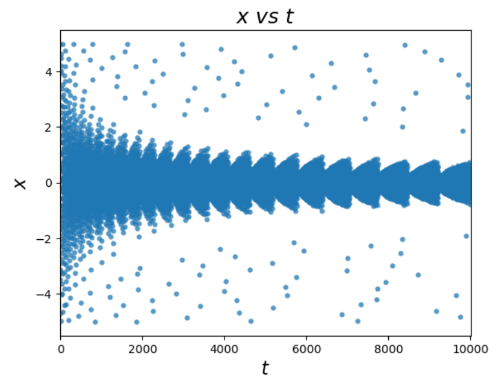

# 模型调参

> #### 参考
>
> * [贝叶斯优化调参-Bayesian optimiazation原理加实践](https://blog.csdn.net/weixin_44052055/article/details/107974298)
> * [机器学习最强调参方法！高斯过程与贝叶斯优化](https://blog.csdn.net/weixin_37737254/article/details/114715182?spm=1001.2101.3001.6650.3&utm_medium=distribute.pc_relevant.none-task-blog-2%7Edefault%7ECTRLIST%7ERate-3-114715182-blog-107974298.pc_relevant_multi_platform_whitelistv3&depth_1-utm_source=distribute.pc_relevant.none-task-blog-2%7Edefault%7ECTRLIST%7ERate-3-114715182-blog-107974298.pc_relevant_multi_platform_whitelistv3&utm_relevant_index=6)
> * [机器学习-深度学习-调参技巧【贝叶斯优化】](https://blog.csdn.net/JianqiuChen/article/details/106634128?utm_medium=distribute.pc_relevant.none-task-blog-2~default~baidujs_baidulandingword~default-4-106634128-blog-107974298.pc_relevant_multi_platform_whitelistv3&spm=1001.2101.3001.4242.3&utm_relevant_index=6)
> * [高斯过程与贝叶斯优化](https://blog.csdn.net/limoumou6541/article/details/102289385)
> * [如何通俗易懂地介绍 Gaussian Process？](https://www.zhihu.com/question/46631426)
> * [ML模型超参数调节：网格搜索、随机搜索与贝叶斯优化](https://www.jianshu.com/p/5378ef009cae)
> * [4种主流超参数调优技术](https://zhuanlan.zhihu.com/p/234509605)
> * [理解多维高斯分布 ](https://zhuanlan.zhihu.com/p/158933383#:~:text=%E4%B8%80%E7%BB%B4%E9%AB%98%E6%96%AF%E5%88%86%E5%B8%83%20%E6%A0%87%E5%87%86%E7%9A%84%E4%B8%80%E7%BB%B4%E9%AB%98%E6%96%AF%E5%88%86%E5%B8%83%E6%98%AF0%E5%9D%87%E5%80%BC%E5%92%8C%E5%8D%95%E4%BD%8D%E6%96%B9%E5%B7%AE%E7%9A%84%EF%BC%8C%E6%95%B0%E5%AD%A6%E5%BD%A2%E5%BC%8F%E5%A6%82%20%281%29%EF%BC%9A%20p%20%28x%29%20%3D%20frac%20%7B1%7D,%7B1%7D%20%E4%B8%BA%E4%BA%86%E6%89%A9%E5%B1%95%E6%88%90%E4%B8%80%E8%88%AC%E7%9A%84%E4%B8%80%E7%BB%B4%E9%AB%98%E6%96%AF%E5%88%86%E5%B8%83%EF%BC%8C%E6%88%91%E4%BB%AC%E5%BC%95%E5%85%A5%E4%B8%80%E4%B8%AA%E7%BA%BF%E6%80%A7%E5%8F%98%E6%8D%A2%20x%20%3A%3D%20A%20%28x-mu%29%20%EF%BC%8C%E7%BB%93%E5%90%88%20%281%29%EF%BC%8C%E6%9C%89%EF%BC%9A)
> * [超参数搜索——网格搜索和随机搜索 ](https://cloud.tencent.com/developer/article/1187140)

# 背景

对于各种模型而言，或多或少都具有要调节的超参数。相同的模型应用在不同的数据集上，如何选择一组最优超参数至关重要，很大程度上决定了模型的性能。**超参数**是在建立模型时用来控制算法行为的参数，这些参数不能从正常的训练过程中学习，他们需要在训练模型之前被分配。

常用的模型调参方法有**网格搜索(grid search)，随机搜索(random search)，以及基于高斯过程的贝叶斯优化(GP based Bayesian optimiazation)**，下面一一介绍这 3 种调参手段，并将重点放在贝叶斯优化上。

# 网格搜索（Grid Search）

网格搜索是一种基本并使用最广泛，也是最自然的超参数调整技术，它类似于手动调优。为网格中指定的所有给定超参数值的每种组合建立模型，并评估和选择最佳模型。例如，一种模型有两个超参数 **k_value =[2,3,4,5,6,7,8,9,10]** 和 **algorithm = [‘auto’, ’ball_tree’, ’kd_tree’, ’brute’]**，在这种情况下，网格搜索总共构建了 **9 * 4 = 36 ​**个不同的模型

**动画演示：**


网格搜索的缺点就是计算量大。我们试想一下，当需要调节的超参数很多，每一种超参数有许多备选值，那么组合起来运行的时间就是天文数字。另外，在深度学习流行的年代，该方法并不适用，因为深度学习本身运行所需时间就长，一般试不了多少个参数组合。

# 随机搜索（Random Search）

有没有什么方法能较好地替代网格搜索吗？**随机搜索**自然被提出来了。使用随机搜索代替网格搜索的动机是，在许多情况下，所有的超参数可能并非同等重要。随机搜索从超参数空间中随机选择参数组合，参数按**​ n_iter** 给定的迭代次数进行选择。随机搜索已经被实践证明比网格搜索得到的结果更好。

**动画演示：**


随机搜索的缺点在于，不能保证我们能够找到全局最小值，当迭代次数较少时，局部最小值可能也不会得到。实际应用过程中，应保证一定的迭代次数，可以在整个超参空间上进行搜索。

# 贝叶斯优化

<u>贝叶斯优化用于机器学习调参</u>由 **J. Snoek(2012)** 提出，主要思想是，给定优化的**目标函数**(广义的函数，只需指定输入和输出即可，无需知道内部结构以及数学性质)，通过*不断地添加样本点*来更新目标函数的*后验分布，即*高斯过程，直到后验分布基本贴合于真实分布。简单的说，就是考虑了上一次参数的信息，从而更好的调整当前的参数。*sequential model-based optimization*(SMBO)是贝叶斯优化的最简形式。

**动画演示：**


下图是贝叶斯优化流程框架：


上图描述了贝叶斯优化的大致流程，从图中我们可以知道该优化方法最为重要的两个组件 PF（先验函数，模型是否初始化）、AC（采集函数）：

* **PF(Priori Function)**
  若模型分布已知，则可以根据经验选择最优的模型；若未知，则可以采用基于高斯过程的核函数作为黑盒函数自己学习
* **AC(Acquisition function)**

  用于找到目标函数下的极大值点（这个点代表着我们模型中需要实验的参数），然后使用这个极大值点投入我们的机器学习或者深度学习模型预测出一个结果，并将这个结果更新到我们的上一步里面的那个高斯分布模型里。不断迭代知道找到一组合适的参数或达到最大迭代次数

  经过多次迭代计算后，基于高斯过程本身具有易陷入局部最优的缺点，我们需要用 AC 来寻找下一个较优的点，那么这就涉及到该步骤的开发和探索之间的权衡
  开发：目的是根据后验分布在更好的区域进行采样，均值越大越好
  探索：目的是在未取样的区域采样，方差越大越好

## 高斯过程回归

接下来我们对高斯过程及回归进行简要阐述

### 高斯过程

高斯过程顾名思义，就是高斯分布 + 随机过程

以下逐步讲解高斯过程：

* 首先当随机变量是 1 维的时候，称之为 1 维高斯分布，公式如下：

  

  这是现实生活中最常见的分布，自然界许多事物遵循正态分布，如学生成绩，身高等等
* 当随机变量的维度上升到有限的 p 维的时候，称之为高维分布
* 更近一步，**高斯过程**是在一个连续域上的无限多个高斯随机变量所组成的随机过程，即高斯过程是一个无限维的高斯分布

  符号描述为：

  > ​​
  >
* 以下的实际例子可以帮助大家更好地建立高斯过程的印象：

  假设对于某一个物种而言，在任何时刻，体能值都满足正态分布（只不过不同的时间点，分布的均值和方差可能不同）

  

  我们在图中选取了 5 个点，相应的有 5 个时刻的体能值，分别满足高斯分布

  为了不失一般性，我们任取一个时刻 t，而图中的两条虚线是两个高斯过程的样本，即我们取遍所有时刻的 t，获得的对应值连成的一条虚线
* 接下来用形式化的语言来描述高斯过程：

  1. 对于 p 维的高斯分布，p 维的均值向量（反映每一维随机变量的期望）和 pxp 的协方差矩阵（反映各维随机变量之间的协方差和各自维度随机变量的方差）决定了此分布
  2. 因为高斯过程是无限维高斯分布，这时就不能用有限的向量和协方差矩阵来决定高斯过程，可以用关于时间 t 的**均值函数** $m(t)$ 来表示其均值；同理，用**核函数** $k(s, t)$ 来表示 s 和 t 时刻的协方差矩阵。核函数是高斯过程的核心，它决定了高斯过程的性质，常见的核函数是**径向基函数:**

     

### 高斯过程回归

高斯过程回归就是 **先验分布 + 观测值，推出后验分布**的过程。即，通过**均值函数**和**核函数**定义一个高斯过程，但没有实际的观测值，所以这是一个先验高斯分布；输入实际的观测值后，修正**均值函数**和**核函数**，得到高斯过程的后验分布

以单个变量为例，经过推导[高斯过程回归](https://www.zhihu.com/question/46631426)，可以得到：

> 
>
> 其中：
>
> 1. $X$ 代表一组观测点向量，$X^*$ 代表余下的非观测点向量
> 2. $Y$ 代表 $X$ 所对应的函数值
> 3. 在没有有效信息的前提下，**均值函数一般取0**

#### 示例

我们以 $y = 0.4sin(x) + N(0, 0,05)$ 为例，示范高斯过程回归拟合

代码如下：

```python
import matplotlib.pyplot as plt
import numpy as np

# 高斯核函数
def guassian_kernel(x1, x2, l=0.5, sigma_f=0.2):
    m, n = x1.shape[0], x2.shape[0]
    dist_matrix = np.zeros((m ,n), dtype=float)
    for i in range(m):
        for j in range(n):
            dist_matrix[i][j] = np.sum((x1[i] - x2[j]) ** 2)
    return sigma_f ** 2 * np.exp(-0.5 / l ** 2 * dist_matrix)

# 生成观测值
def getY(X):
    X = np.asarray(X)
    Y = np.sin(X)*0.4 + np.random.normal(0, 0.05, size=X.shape)
    return Y.tolist()

# 根据观察点X，修正生成高斯过程新的均值和协方差
def update(X, X_star):
    X = np.asarray(X)
    X_star = np.asarray(X_star)
    K_YY = guassian_kernel(X, X) # K(X, X)
    K_ff = guassian_kernel(X_star, X_star) # K(X*, X*)
    K_Yf = guassian_kernel(X, X_star)
    K_fY = K_Yf.T
    K_YY_inv = np.linalg.inv(K_YY + 1e-8 * np.eye(len(X)))
  
    mu_star = K_fY.dot(K_YY_inv).dot(Y)
    cov_star = K_ff - K_fY.dot(K_YY_inv).dot(K_Yf)
    return mu_star, cov_star

# 演示高斯过程回归
f, ax = plt.subplots(2, 1, sharex=True, sharey=True)
# 绘制高斯过程先验
X_pre = np.arange(0, 10, 0.1)
mu_pre = np.array([0]*len(X_pre))
Y_pre = mu_pre
cov_pre = guassian_kernel(X_pre, X_pre)
uncertainly = 1.96 * np.sqrt(np.diag(cov_pre)) # 计算95%的置信区间
ax[0].fill_between(X_pre, Y_pre + uncertainly, Y_pre - uncertainly, alpha=0.1)
ax[0].plot(X_pre, Y_pre, label="expection")
ax[0].legend()

# 绘制基于观测值的高斯过程后验
X = np.array([1, 3, 5, 7, 8, 10]).reshape(-1, 1)
Y = getY(X)
X_star = np.arange(0, 10, 0.1).reshape(-1, 1)
mu_star, cov_star = update(X, X_star)
Y_star = mu_star.ravel()
uncertainly = 1.96 * np.sqrt(np.diag(cov_star))
ax[1].fill_between(X_star.ravel(), Y_star + uncertainly, Y_star - uncertainly, alpha=0.1)
ax[1].plot(X_star, Y_star, label="expection")
ax[1].scatter(X, Y, label="observation point", c="red", marker="x")
ax[1].legend()
plt.show()
```

先验高斯过程分布的曲线（淡蓝色透明区域为 95% 的置信区间）：


加入观测点信息后，后验分布的曲线为：


真实曲线为：
​

# 贝叶斯优化代码

以下展示贝叶斯优化包 **Hyperopt** 的基本用法，以优化函数 $y = x^2$ 为例：

```python
# 深入内部，查看过程
# 定义空间
fspace = {
    'x': hp.uniform('x', -5, 5)
}

# 定义目标函数
def f(params):
    x = params['x']
    val = x**2
    return {'loss': val, 'status': STATUS_OK}

trials = Trials()
best = fmin(fn=f, space=fspace, algo=tpe.suggest, max_evals=10000, trials=trials)

print('best:', best)
print('trials:')
for trial in trials.trials[:2]:
    print(trial)

# 可视化1
f, ax = plt.subplots(1)
xs = [t['tid'] for t in trials.trials]
ys = [t['misc']['vals']['x'] for t in trials.trials]
ax.set_xlim(xs[0]-10, xs[-1]+10)
ax.scatter(xs, ys, s=20, linewidth=0.01, alpha=0.75)
ax.set_title('$x$ $vs$ $t$', fontsize=18)
ax.set_xlabel('$t$', fontsize=16)
ax.set_ylabel('$x$', fontsize=16)
```

贝叶斯优化过程中对于变量 x 的选择：

​​

​​

‍
