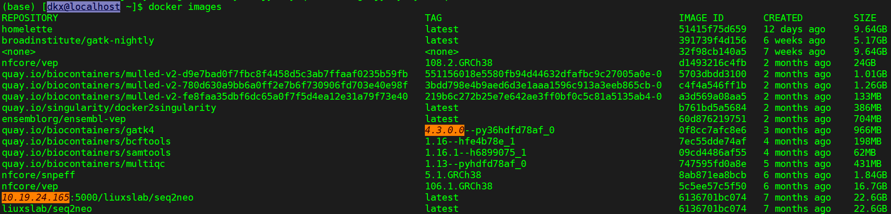

# 容器技术 -- Docker & Singularity

# Docker容器技术

## Docker简介

容器是一种Linux上广为采用的应用封装技术，它将可执行程序与依赖库打包成一个镜像文件，启动时与宿主节点共享操作系统内核。 由于镜像文件同时携带可执行文件和依赖库，避免了两者不匹配造成的兼容性问题，还能在一个宿主Linux操作系统上支持多种不同的Linux发行版

Docker采用的是 **Go语言** 编写的，该语言一种静态强类型、编译型、并发型，并具有垃圾回收功能的编程语言，常用于Web程序开发，并且具有成熟的Web开发框架，如Beego、Gin、Iris等等；Docker具有3个基本的概念：

* **镜像（Image）**：Docker 镜像（Image），就相当于是一个 root 文件系统。比如官方镜像 ubuntu:16.04 就包含了完整的一套 Ubuntu16.04 最小系统的 root 文件系统

* **容器（Container）**：镜像（Image）和容器（Container）的关系，就像是面向对象程序设计中的类和实例一样，镜像是静态的定义，容器是镜像运行时的实体。容器可以被创建、启动、停止、删除、暂停等
* **仓库（Repository）**：仓库可看成一个代码控制中心，用来保存镜像

Docker采用CS架构（客户端-服务器架构）。Docker启动后，会一直运行一个docker守护进程（服务端），我们在命令行输入的docker命令，实际上就是使用的Docker的客户端程序在与守护进程进行交互

## Centos系统安装Docker

Docker支持的Centos版本包括Centos 7、Centos 8 以及更高；Docker 17.03之前的版本被称为 docker，docker.io 或 docker-engine，之后分为 **CE**（Community Edition: 社区版） 和 **EE**（Enterprise Edition: 企业版），个人或者小规模使用采用CE版本就行了

### 手动安装

1. 如果系统上有较旧的Docker，请先卸载它及其依赖再安装

    ```js
    $ sudo yum remove docker \
                      docker-client \
                      docker-client-latest \
                      docker-common \
                      docker-latest \
                      docker-latest-logrotate \
                      docker-logrotate \
                      docker-engine
    ```
2. 设置稳定的Docker仓库，之后就从仓库下载和更新Docker

    ```js
    # 下载依赖
    $ sudo yum install -y yum-utils \
      device-mapper-persistent-data \
      lvm2
    ## 添加源；官方源下载缓慢
    $ sudo yum-config-manager \
        --add-repo \
        https://download.docker.com/linux/centos/docker-ce.repo
    ## 阿里云源
    $ sudo yum-config-manager \
        --add-repo \
        http://mirrors.aliyun.com/docker-ce/linux/centos/docker-ce.repo
    ## 清华源
    $ sudo yum-config-manager \
        --add-repo \
        https://mirrors.tuna.tsinghua.edu.cn/docker-ce/linux/centos/docker-ce.repo
    ## 注意，Dokcer会自动添加docker用户组，但组里没有用户
    ```
3. 安装Docker Engine-Community

    ```js
    ## 安装最新版本的Docker Engine-Community和containerd
    $ sudo yum install docker-ce docker-ce-cli containerd.io docker-compose-plugin  # 如果提示您接受 GPG 密钥，请选是

    ## 或者 安装特定版本的Docker Engine-Community
    $ yum list docker-ce --showduplicates | sort -r  # 列出可安装的Docker版本
    $ sudo yum install docker-ce-<VERSION_STRING> docker-ce-cli-<VERSION_STRING> containerd.io
    ```
4. 将有需求的用户加入到docker用户组，以便不通过`sudo`​​使用docker

    ```js
    # 两种方法
    # 1.usermod
    $ sudo groupadd docker  # 添加docker用户组
    $ sudo usermod -aG docker ${USER}  # 将用户添加至docker用户组
    $ sudo systemctl restart docker  # 重新运行docker
    # Ctrl+D重新登录，刷新缓存

    # 2.gpasswd 
    $ sudo groupadd docker  # 添加docker用户组
    $ sudo gpasswd -a ${USER} docker  # 将用户添加至docker用户组
    $ sudo systemctl restart docker  # 重新运行docker
    $ newgrp docker  # 刷新groups缓存
    ```
5. 启动Docker并测试

    ```js
    # 启动Docker
    $ sudo systemctl start docker
    # 测试Docker
    $ dokcer run hello-world  # 如出现下载成功并显示Hello from Docker!字样，则代表Docker安装成功
    # 设置开机自启
    $ sudo systemctl enable docker
    ```

### 自动化脚本安装

Docker 在 [get.docker.com ](https://get.docker.com/)和 [test.docker.com](https://test.docker.com/) 上提供了方便脚本，用于将快速安装 Docker Engine-Community 的edge版本和测试版本，脚本的源代码在 docker-install 仓库中。需要注意的是：1. 会安装大量的依赖包；2. 脚本运行需要root或者sudo权限；3. 脚本自动化安装，不能自定义任何安装参数，不能指定安装版本，会下载最新的edge版本或者测试版本

安装命令如下：

```js
# edge最新版本
$ curl -fsSL https://get.docker.com | bash -s docker --mirror Aliyun
# 也可以使用国内 daocloud 一键安装命令
$ curl -sSL https://get.daocloud.io/docker | sh

# test最新版本
$ curl -fsSL https://test.docker.com | bash -s docker --mirror Aliyun
# 也可以使用国内 daocloud 一键安装命令
$ curl -sSL https://test.daocloud.io/docker | sh
```

### 删除Docker

```js
# 删除安装包
$ sudo yum remove docker-ce
# 删除镜像、容器、配置文件等内容；若data-root改变，则删除对应目录
$ sudo rm -rf /var/lib/docker
```

## Docker镜像

Docker镜像是容器的基础，我们可以把**镜像和容器的关系**类比成编程语言中的**类和实例**，镜像是静态不可变的，容器是动态可变的，容器基于镜像产生并用于生产环境；当运行容器时，使用的镜像如果在本地中不存在，docker 就会自动从 docker 镜像仓库中下载，默认是从 **Docker Hub** 公共镜像源下载

镜像采用分层存储的方式，以节省磁盘空间和网络带宽；在下载镜像时，**Docker Daemon**会检查镜像中的镜像层与宿主机文件系统中的镜像层进行对比，如果存在则不下载，只下载不存在的镜像层

镜像是read-only的，由镜像生成的容器，并在容器中进行操作，都只是增量操作，不会对镜像本身产生作用，这样保证了由该镜像生成的下一个容器是干净可重复的

### 列出本地镜像

我们可以使用`docker images`​ 来列出主机中已下载的镜像：

​​

其中：**REPOSITORY ​**表示镜像的仓库源；**TAG ​**镜像的标签；**IMAGE ID ​**镜像ID，唯一的；**CREATED ​**镜像创建时间；**SIZE ​**镜像大小

同一仓库源可以有多个 TAG，代表这个仓库源的不同个版本，默认下载版本是**latest**

### 下载新镜像

当我们在本地主机上使用一个不存在的镜像时 Docker 就会自动下载这个镜像；如果我们想预先下载这个镜像，我们可以使用 `docker pull`​ 命令来下载它，随后可以通过`docker images`​查看镜像

```js
(base) [dkx@localhost ~]$ docker pull centos:latest
latest: Pulling from library/centos
a1d0c7532777: Pull complete 
Digest: sha256:a27fd8080b517143cbbbab9dfb7c8571c40d67d534bbdee55bd6c473f432b177
Status: Downloaded newer image for centos:latest
docker.io/library/centos:latest
```

### 搜索镜像

```js
(base) [dkx@localhost ~]$ docker search httpd
NAME                                 DESCRIPTION                                     STARS     OFFICIAL   AUTOMATED
httpd                                The Apache HTTP Server Project                  4327      [OK]     
clearlinux/httpd                     httpd HyperText Transfer Protocol (HTTP) ser…   2                  
avenga/httpd-static                                                                  0                  
betterweb/httpd                                                                      0                  
centos/httpd-24-centos7              Platform for running Apache httpd 2.4 or bui…   45                 
manageiq/httpd                       Container with httpd, built on CentOS for Ma…   1                    [OK]
centos/httpd-24-centos8                                                              1                  
dockerpinata/httpd                                                                   1                  
19022021/httpd-connection_test       This httpd image will test the connectivity …   0                  
paketobuildpacks/httpd                                                               0                  
centos/httpd                                                                         36                   [OK]
publici/httpd                        httpd:latest                                    1                    [OK]
```

其中，**NAME:** 镜像仓库源的名称；**DESCRIPTION:** 镜像的描述；**OFFICIAL:** 是否 docker 官方发布；**STARS:** 类似 Github 里面的 star，表示点赞、喜欢的意思；**AUTOMATED:** 自动构建

### 删除镜像

镜像删除使用 `docker rmi`​命令，比如我们删除 centos 镜像：

```js
(base) [dkx@localhost ~]$ docker rmi centos:latest
Untagged: centos:latest
Untagged: centos@sha256:a27fd8080b517143cbbbab9dfb7c8571c40d67d534bbdee55bd6c473f432b177
Deleted: sha256:5d0da3dc976460b72c77d94c8a1ad043720b0416bfc16c52c45d4847e53fadb6
Deleted: sha256:74ddd0ec08fa43d09f32636ba91a0a3053b02cb4627c35051aff89f853606b59
```

### 创建镜像

当我们从 docker 镜像仓库中下载的镜像不能满足我们的需求时，我们可以通过以下**两种方式**对镜像进行更改，以创建自己的镜像

* 从已经创建的容器中更新镜像，并且提交这个镜像
* 使用 Dockerfile 指令来创建一个新的镜像

#### 从容器中更新镜像

```js
# 运行一个Ubuntu基础镜像
$ docker run -it ubuntu:latest /bin/sh
# 在容器中执行apt-get update命令，更新索引
$ apt-get update
# Ctrl+D退出容器，并提交容器为镜像，镜像名为diaokx/ubuntu，版本号是v2
$ docker commit -m="has update" -a="diaokx" e218edb10161 diaokx/ubuntu:v2
```

其中，**-m:** 提交的描述信息；**-a:** 指定镜像作者；**e218edb10161：** 容器 ID；**diaokx/ubuntu:v2:** 指定要创建的目标镜像名

#### Dockerfile构建镜像

##### 语法格式

我们可以使用命令 `docker build`​ ， 从零开始来创建一个新的镜像。为此，我们需要创建一个 Dockerfile 文件，其中包含一组指令来告诉 Docker 如何构建我们的镜像，Dockerfile文件中的语法格式为：

* FROM- 镜像从那里来，即基于什么镜像；注意，**Docker 17.05**版本以后，新增了Dockerfile多阶段构建，所谓多阶段构建，实际上是允许一个Dockerfile 中出现多个 `FROM`​ 指令，最后生成的镜像，以最后一条 FROM 为准，之前的 FROM 会被抛弃，之前FROM生成的文件可以由`COPY --from=<image> source target`​拷贝到后续构建阶段，例如

  ```js
  ####  构建阶段  ####
  # Go语言环境基础镜像
  FROM golang:1.10.3 AS go_env
  # 将源码拷贝到镜像中
  COPY server.go /build/
  # 指定工作目录
  WORKDIR /build
  # 编译镜像时，运行 go build 编译生成 server 程序
  RUN CGO_ENABLED=0 GOOS=linux GOARCH=amd64 GOARM=6 go build -ldflags '-w -s' -o server

  # 基础镜像 golang:1.10.3 是非常庞大的，因为其中包含了所有的Go语言编译工具和库，
  # 而运行时候我们仅仅需要编译后的 server 程序就行了，不需要编译时的编译工具，最后生成的大体积镜像就是一种浪费

  #### 运行阶段  ####
  FROM scratch
  # 从编译阶段的中拷贝编译结果到当前镜像中
  COPY --from=go_env /build/server /

  # 指定容器运行时入口程序 server
  ENTRYPOINT ["/server"]
  ```
* MAINTAINER- 镜像维护者信息，即姓名或邮箱地址，现在已经弃用，由`LABEL maintainer="author"`​代替

  ```bash
  MAINTAINER <name>
  ```
* LABEL- 该指令用来给镜像添加一些元数据（metadata），以键值对的形式存在；新版本中不推荐使用`MAINTAINER`​，可以由`LABEL maintainer="author"`​代替

  ```bash
  LABEL <key>=<value> <key>=<value> <key>=<value> ...
  # 维护者姓名
  LABEL maintainer="diaokx"
  ```

* RUN- 构建镜像执行的命令，每一次RUN都会构建一层；Dockerfile 的指令每执行一次都会在 docker 上新建一层。所以过多无意义的层，会造成镜像膨胀过大。例如：

  ```dockerfile
  FROM centos
  RUN yum -y install wget
  RUN wget -O redis.tar.gz "http://download.redis.io/releases/redis-5.0.3.tar.gz"
  RUN tar -xvf redis.tar.gz
  # 可以改成
  FROM centos
  RUN yum -y install wget \
      && wget -O redis.tar.gz "http://download.redis.io/releases/redis-5.0.3.tar.gz" \
      && tar -xvf redis.tar.gz
  ```
* CMD- 容器启动的命令，如果有多个则以最后一个为准，也可以为ENTRYPOINT提供参数；CMD 指令指定的程序可被 `docker run`​​ 命令行参数中指定要运行的程序所覆盖

  ```js
  CMD <shell 命令> 
  CMD ["<可执行文件或命令>","<param1>","<param2>",...] 
  CMD ["<param1>","<param2>",...]  # 该写法是为 ENTRYPOINT 指令指定的程序提供默认参数
  ```
* VOLUME- 定义数据卷，如果没有定义则使用默认，可被`dokcer run -v`​​覆盖
* USER- 指定后续执行指令的用户和用户组
* WORKDIR- 切换当前执行的工作目录，相当于shell中的`cd`​​
* HEALTHCHECH- 健康检测指令
* ARG- 变量属性值，只在`docker build`​中起作用（Dockerfile中），但不在容器内部起作用；构建命令 `docker build`​ 中可以用`--build-arg <参数名>=<值>`​来覆盖

  ```js
  ARG <参数名>[=<默认值>]
  ```
* EXPOSE- 仅仅是声明端口，帮助镜像使用者理解容器中运行的服务所需的端口
* ENV- 变量属性值，容器内部也会起作用

  ```js
  ENV <key> <value>
  ENV <key1>=<value1> <key2>=<value2>...
  ```
* ADD- 拷贝文件或目录到容器中，如果是URL或压缩包便会自动下载或自动解压
* COPY- 拷贝文件或目录到容器中，跟ADD类似，但不具备自动下载或解压的功能

  ```bash
  COPY [--chown=<user>:<group>] <源路径1>...  <目标路径>
  COPY [--chown=<user>:<group>] ["<源路径1>",...  "<目标路径>"]
  # [--chown=<user>:<group>]：可选参数，用户改变复制到容器内文件的拥有者和属组
  ```
* ENTRYPOINT- 容器进入时执行的命令，CMD此时作用是传参
* ONBUILD- 用于延迟构建命令的执行，指定的指令不会在本次构建中执行，而是在下次引用了该镜像的构建中执行

##### 构建镜像

我们有Dockerfile，其内容为：

```dockerfile
# 构建一个安装docker & singularity的centos镜像
FROM centos:7.9.2009
LABEL maintainer diaokx

RUN useradd diaokx
ENV PATH=/home/diaokx:$PATH IMAGE_VERSION=v1.0

# 拷贝文件
COPY file /

# 安装docker
RUN yum install -y yum-utils device-mapper-persistent-data lvm2 \
    && yum-config-manager --add-repo http://mirrors.aliyun.com/docker-ce/linux/centos/docker-ce.repo \
    && yum install -y docker-ce docker-ce-cli containerd.io docker-compose-plugin
RUN gpasswd -a diaokx docker && newgrp docker

# 安装GO 和 singularity
RUN yum install -y gcc libuuid-devel squashfs-tools openssl-devel make wget
ARG VERSION=1.19.4 OS=linux ARCH=amd64
RUN wget -c https://dl.google.com/go/go$VERSION.$OS-$ARCH.tar.gz \
    && tar -C /usr/local -xzvf go$VERSION.$OS-$ARCH.tar.gz \ 
    && rm -f go$VERSION.$OS-$ARCH.tar.gz
ENV PATH /usr/local/go/bin:$PATH

ARG VERSION=3.9.2
RUN wget -c https://github.com/sylabs/singularity/releases/download/v${VERSION}/singularity-ce-${VERSION}.tar.gz \
    && tar -xzf singularity-ce-${VERSION}.tar.gz \
    && rm -f singularity-ce-${VERSION}.tar.gz
WORKDIR /singularity-ce-${VERSION}
RUN ./mconfig --prefix=/opt/singularity/${VERSION} \
    && cd builddir/ \
    && make && make install
ENV PATH /opt/singularity/${VERSION}/bin:$PATH

WORKDIR /
RUN rm -rf /singularity-ce-${VERSION}

VOLUME [ "/home/" ]

# 随便声明一个端口
EXPOSE 8888

CMD [ "/bin/bash" ]
```

通过`docker build -t image_diaokx:v1.0 .`​构建镜像，其中，**-t**  指定要创建的目标镜像名，**.** 指定Dockerfile 文件所在目录，可以指定Dockerfile 的绝对路径；如果想在docker容器里使用`systemctl`​命令，需要这样启动容器：

```bash
$ docker run -d --name container_diaokx --privileged=true image_diaokx:v1.0 /usr/sbin/init
$ docker exec -it container_diaokx /bin/bash
```

### 设置镜像标签

使用 docker tag 命令，为镜像添加一个新的标签：

```bash
$ docker tag 860c279d2fec image_diaokx:v2.0
```

## Docker容器

介绍下常见的指令：

* ​`docker pull <image:tag>`​   拉取特定版本的镜像，默认tag为latest
* ​`docker run <image> <command>`​  创建一个新的容器并运行一个命令，`-it`​ 交互式运行，`-d`​后台运行，`-p ​`​网络端口映射，`-v ​`​目录映射
* ​`docker start <container id / name>`​  启动一个已停止运行的容器
* ​`docker restart <container id / name>`​  重新启动一个正在运行的容器
* ​`docker stop <container id / name>`​  停止一个正在运行的容器
* ​`docker attach <container id / name>`​  进入一个正在运行的容器，如果从这个容器退出，会导致容器的停止
* ​`docker exec <container is / name> <command>`​ 在一个正在运行的容器中执行一条命令，`-it`​ 交互式运行

  ​`docker exec -it <container id / name> /bin/bash`​ 和 `docker attach <container id / name>`​ 都是进入容器中，但`exec`​退出不会导致容器停止
* ​`docker rm <container id / name>`​  删除一个停止运行容器
* ​`docker container prune`​  删除所有处于终止状态的容器
* ​`docker ps -a`​  列出所有的容器
* ​`docker port <container id / name>`​  查看容器的端口映射情况
* ​`docker logs -f <container id / name>`​  查看容器内部的标准输出
* ​`docker inspect <container id / name | image is / name>`​  检查镜像或者容器的元数据
* ​`docker cp <container : source> <target>`​​ **OR** `docker cp <source> <container : target>`​​  用于容器和主机之间的数据拷贝

## 镜像\容器的导出导入

考虑这样一种情况：假如你本地有一个很大的镜像，你的同事想要该镜像运行，但是该镜像不管是用Dockerfile构建还是`docker pull`​下载，都需要很久，那能不能将你本地所拥有的这个镜像打包发送给同事，导入后运行呢？答案是肯定的，Docker官方已经想到了这种情况，Docker镜像可以导入导出，用于迁移、备份、升级等场景，涉及的命令有`export、import、save、load`​

**注意：** export导出的文件再import回去时，无法保留镜像所有历史（即Dockerfile每一层的layer信息），不能进行回滚操作；而save是依据镜像来的，所以导入时可以完整保留下每一层layer信息。可以通过`docker history`​查看

### 镜像的导出导入

本地镜像的导出采用`docker save`​，格式为`docker save [options] images [images...]`​，示例为：

```bash
$ docker save -o nginx.tar nginx:latest 
# 或者
$ docker save > nginx.tar nginx:latest
```

nginx.tar可以导入docker本地镜像仓库中：

```bash
$ docker load -i nginx.tar
# 或者
$ docker load < nginx.tar
```

### 容器的导出导入

对于容器，也可以将其导出为tar文件，随后导入docker本地镜像仓库中：

```bash
## 导出
$ docker export -o nginx-test.tar nginx-test
# 或者
$ docker export nginx-test > nginx-test.tar

## 导入
$ docker import nginx-test.tar nginx:imp
# 或者
$ cat nginx-test.tar | docker import - nginx:imp
```

# Singularity容器技术

## Singularity简介

Singularity容器技术是为了弥补Docker在高性能计算集群HPC表现不佳而提出的（需要root权限，不够轻量级，性能损失较大），其也是基于Go语言编写。Singularity 强调容器服务的便捷性、可移植性和可扩展性，而弱化了容器进程的*高度隔离性*，因此量级更轻，内核namespace更少，性能损失更小；另外，Singularity 同时支持root用户和非root用户启动，且容器启动前后，**用户上下文保持不变，这使得用户权限在容器内部和外部都是相同的；** 然而，Singularity它的知名度远不如 Docker，社区支持较少，在国内也没有镜像源导致*下载镜像速度非常慢甚至失败*

Singularity的重要概念：1. **SIF（Singularity Image File）**：压缩后的只读*（read-only）*的Singularity镜像文件，是**生产**使用的主要形式；2. **Sandbox**：可写(writable)的容器存在形式，是文件系统中的一个目录，常用于开发或者创建自己的容器，是**开发**使用的主要形式

## Centos系统安装Singularity

以下是在有root权限的主机上进行：

```bash
# 安装依赖
yum install -y gcc libuuid-devel squashfs-tools openssl-devel make

# 安装go
export VERSION=1.17.2 OS=linux ARCH=amd64   
wget https://dl.google.com/go/go$VERSION.$OS-$ARCH.tar.gz 
tar -C /usr/local -xzvf go$VERSION.$OS-$ARCH.tar.gz
rm -f go$VERSION.$OS-$ARCH.tar.gz 
echo 'export PATH=/usr/local/go/bin:$PATH' >> /etc/profile
source /etc/profile

# 安装singularity
export VERSION=3.9.2
wget https://github.com/sylabs/singularity/releases/download/v${VERSION}/singularity-ce-${VERSION}.tar.gz 
tar -xzf singularity-ce-${VERSION}.tar.gz
cd singularity-ce-${VERSION}
./mconfig --prefix=/opt/singularity/${VERSION}
cd builddir/
make && make install
echo "export PATH=/opt/singularity/${VERSION}/bin:$PATH" >> /etc/profile
```

## Singularity下载镜像

下载的指令有两条：一个是`singularity build`​，另一个是`singularity pull`​；`singularity build`​是镜像构建命令，如果所需的镜像本地没有则会自动下载，而`singularity pull`​是专门的下载指令

### 从外部源下载

以下命令会从指定的源下载指定的镜像，`singularity pull`​和`singularity build`​均可以：

* 从Docker Hub下载，`singularity build ./jason-tensorflow.sif docker://tensorflow/tensorflow:latest-gpu`​ [Docker Hub](https://hub.docker.com/)
* 从Singularity Hub下载容器，`singularity pull hello.sif shub://vsoch/hello-world`​  [Singularity Hub](http://datasets.datalad.org/?dir=/shub)
* 从Container Library下载容器，`singularity build lolcow.sif library://sylabs-jms/testing/lolcow`​  [Sylabs Cloud](https://cloud.sylabs.io/library)
* 支持 ORAS 的 OCI 镜像云平台下载，`singularity pull image.sif oras://registry/namespace/image:tag`​

### 从本地docker镜像导入

singularity 下载docker上的镜像有时候下载太慢，可以用本地保存的docker镜像文件转换成sif文件，有以下两种方法：

#### 采用docker-archive

利用Singularity官方预留的接口**docker-archive**

```bash
# 下载docker镜像到本地：
$ docker pull omicsclass/pop-evol-gwas:v1.2

# 保存镜像文件
$ docker save omicsclass/pop-evol-gwas:v1.2  > pop-evol-gwas.tar

# 上传tar文件到服务器，转换成沙箱，可以进一步编辑
$ singularity build --sandbox pop-evol-gwas docker-archive://pop-evol-gwas.tar  #沙箱
# 或者 直接转换成sif文件使用
$ singularity build  pop-evol-gwas.sif docker-archive://pop-evol-gwas.tar  #sif 文件
```

#### 自建docker本地镜像源

利用Docker官方提供的工具docker-registry，构建私有的镜像仓库

* 构建私有docker镜像仓库并上传docker镜像：

  ```bash
  # 下载registry镜像
  $ docker pull registry:latest

  # 利用registry构建私有仓库，默认情况下，仓库会被创建在容器的/var/lib/registry目录下
  # 可以通过 -v 参数来将镜像文件存放在本地的映射路径。例如下面的命令，将上传的镜像放到本地的 /opt/data/registry 目录
  $ docker run -d -p 5000:5000 -v /opt/data/registry:/var/lib/registry registry

  # 标记镜像
  $ docker tag ubuntu:latest 127.0.0.1:5000/ubuntu:latest
  # 上传镜像到本地仓库
  $ docker push 127.0.0.1:5000/ubuntu:latest
  # 上传完之后，利用curl查看仓库中的镜像
  $ curl 127.0.0.1:5000/v2/_catalog  # 输出 {"repositories":["ubuntu"]}，表明镜像已经成功被上传到本地仓库了
  ```
* 如果你希望内网里的其他主机<比如，学校的服务器>也能push或pull当前主机仓库中的镜像，那就需要将**127.0.0.1:5000**替换为本主机的地址，例如**10.19.24.165:5000**，但是这样直接修改会报错，因为docker默认不允许非https的方式推送镜像。我们可以通过修改docker的配置选项来取消这个限制：1. `vim /etc/docker/daemon.json`​；2. 在其中加入`"insecure-registries": [“10.19.24.165:5000”]`​
* 从私有仓库下载并构建singularity image，其中 `SINGULARITY_NOHTTPS=1`​ 是为了解决 https 的问题，否则会报错

  ​`SINGULARITY_NOHTTPS=1 singularity build ubuntu.sif docker://10.19.24.165:5000/ubuntu:latest`​​

## 自行构建Singularity镜像

主要有以下几个步骤：

* 建立singularuty sandbox（文件夹形式），`singularity build --sandbox centos_pre docker://centos:7.9.2009`​​
* 通过交互的方式进入容器镜像，进行软件的安装，配置依赖环境，`singularity shell -w molspin`​​，-w等于--writable 可修改
* 退出sandbox，生成sif文件，`singularity build centos_pre.sif centos_pre/`​​

SIF和sandbox两种格式的镜像是可以相互转换的：1. 将SIF格式的容器转换成sandbox `singularity build --sandbox centos76 centos76.sif`​；2. 将sandbox容器镜像转化成SIF格式 `singularity build centos76.sif centos76/`​

## 常用的Singularity命令

在执行命令之前，我们最好重新设置临时文件夹，防止默认临时文件夹 **/tmp** 爆满而导致运行失败：`export SINGULARITY_TMPDIR=/home/user/tmp`​、`export TMPDIR=/home/user/tmp`​

以下为常用的示例命令，可加 **-B** 参数， 表示挂载，多个挂载用逗号隔开：

* 执行一个命令并退出，`singularity exec ubuntu.sif bash -c  "pwd && id"`​​
* 运行一个镜像，`singularity run ubuntu.sif`​
* 交互式进入镜像，`singularity shell ubuntu.sif`​ **OR** `singularity shell -w ubuntu`​
* 检查镜像的metadata，`singularity inspect ubuntu.sif`​
* 搜索镜像，`singularity search <key word>`​
* 与docker对应，singularity也可以基于SIF文件创建**容器实例：**

  ```bash
  # 启动容器实例
  $ singularity instance start -B /home:/home /home/user/singularity-images/image_name.sif container_name

  # 查看已启动的容器实例
  $ singularity instance list

  # 操作容器实例，exec、shell、run
  $ singularity shell instance://container_name
  $ singularity exec instance://container_name bash -c "pwd && id"

  # 停止容器实例
  $ singularity stop instance://container_name
  ```

‍
