### 参考资料

- pheatmap包的Document
- pheatmap介绍：https://www.jianshu.com/p/42c643a43a1f#fn3
- 相关系数矩阵包介绍：https://www.jianshu.com/p/b76f09aacd9c
- 色块控制：https://www.jianshu.com/p/6b765e83d723
- 配色：https://www.jianshu.com/p/e50babec45cb


### R包工具

可以绘制热图的包有很多，这里列举一下

- pheatmap::pheatmap （常用热图）
- stats::heatmap（基本热图）
- gplots::heatmap.2 （基本增强热图）
- ComplexHeatmap (适用于基因组分析的复杂热图)
- ggplot2::ggplot（ggplot可视化）
- heatmaply::heatmaply（交互式）

- ......


### 为什么做热图？

- 热图可以直观上通过颜色深浅来呈现多个变量之间的关系或者区别
- 热图可以呈现出多变量聚类结果


### 基本元素

- 数据预处理
- 热图主图参数
- 注释内容（显著性；图例）


### 解决问题

- 色块控制（热图红蓝色块问题，数字大小和正负值问题）
- 显示部分热图
- 标记相关系数热图显著性
- 数值差异太大热图区分不明显
- 配色


### pheatmap包

#### 1. 简单介绍

`pheatmap`包中的`pheatmap`函数能够对输入数据进行 k-means聚类和层次聚类，但是数据的行数超过1000时无法进行聚类。


#### 2. 函数参数

```R
pheatmap(mat, color = colorRampPalette(rev(brewer.pal(n = 7, name =
  "RdYlBu")))(100), kmeans_k = NA, breaks = NA, border_color = "grey60",
  cellwidth = NA, cellheight = NA, scale = "none", cluster_rows = TRUE,
  cluster_cols = TRUE, clustering_distance_rows = "euclidean",
  clustering_distance_cols = "euclidean", clustering_method = "complete",
  clustering_callback = identity2, cutree_rows = NA, cutree_cols = NA,
  treeheight_row = ifelse((class(cluster_rows) == "hclust") || cluster_rows,
  50, 0), treeheight_col = ifelse((class(cluster_cols) == "hclust") ||
  cluster_cols, 50, 0), legend = TRUE, legend_breaks = NA,
  legend_labels = NA, annotation_row = NA, annotation_col = NA,
  annotation = NA, annotation_colors = NA, annotation_legend = TRUE,
  annotation_names_row = TRUE, annotation_names_col = TRUE,
  drop_levels = TRUE, show_rownames = T, show_colnames = T, main = NA,
  fontsize = 10, fontsize_row = fontsize, fontsize_col = fontsize,
  angle_col = c("270", "0", "45", "90", "315"), display_numbers = F,
  number_format = "%.2f", number_color = "grey30", fontsize_number = 0.8
  * fontsize, gaps_row = NULL, gaps_col = NULL, labels_row = NULL,
  labels_col = NULL, filename = NA, width = NA, height = NA,
  silent = FALSE, na_col = "#DDDDDD", ...)
```


#### 3. 数据处理（这里先创建矩阵）

```R
> library(pheatmap)
> # Create test matrix
> test = matrix(rnorm(200), 20, 10)
> test[1:10, seq(1, 10, 2)] = test[1:10, seq(1, 10, 2)] + 3
> test[11:20, seq(2, 10, 2)] = test[11:20, seq(2, 10, 2)] + 2
> test[15:20, seq(2, 10, 2)] = test[15:20, seq(2, 10, 2)] + 4
> colnames(test) = paste("Test", 1:10, sep = "")
> rownames(test) = paste("Gene", 1:20, sep = "")
> head(test, 5)
          Test1       Test2    Test3      Test4    Test5      Test6    Test7      Test8
Gene1 2.9506296  0.04980323 3.385544  1.1669879 1.885813 -0.9771256 3.112077 -0.6027554
Gene2 2.0099044  0.51020937 4.011563  0.2758383 5.311161 -0.5104894 1.078437  1.2681561
Gene3 3.8667236 -1.00110670 1.763909 -0.4958210 2.814205  0.9438923 2.238253  2.6206316
Gene4 2.1241335 -0.17389532 3.381439  0.9546686 5.046722 -1.5613329 2.322061 -1.4255754
Gene5 0.2062854  0.45703810 3.471799 -1.2390113 2.333674 -1.0852306 3.996635 -0.8064933
         Test9       Test10
Gene1 3.365981 -1.257651534
Gene2 0.727328 -0.004095374
Gene3 5.569084  0.020165678
Gene4 2.413953 -0.644605108
Gene5 2.838279 -0.004935564
```


#### 4. 画热图

- 默认参数

```R
> pheatmap(test)
```

参数都没有设置，聚类是默认的，默认同时对矩阵数据的行和列聚类，可以单独设置仅仅对行或者列聚类。

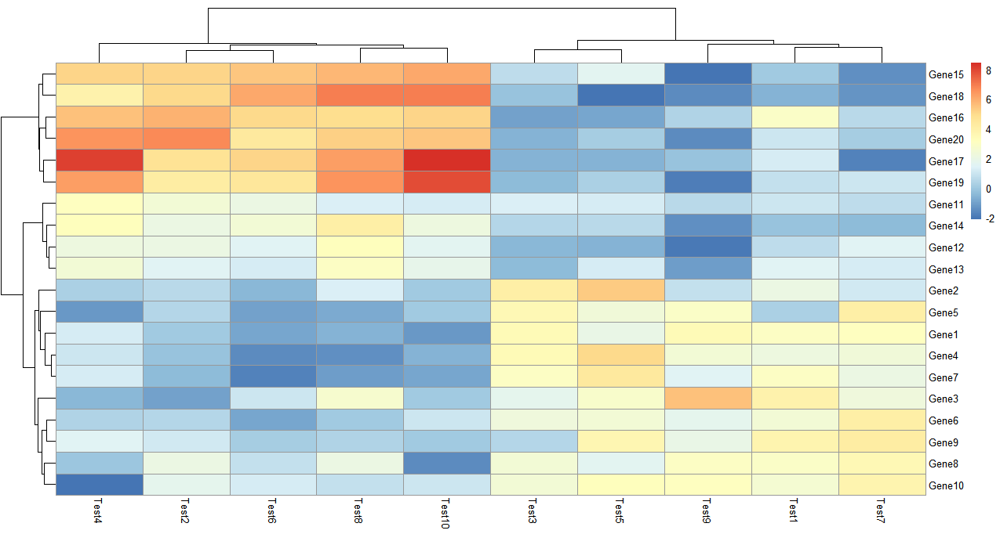


```R
> pheatmap(test, cluster_row = FALSE)
```

参数需要设置布尔值，`cluster_row = FALSE` 即不对行聚类

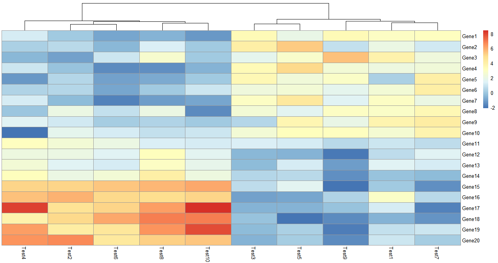

- K-means聚类

```R
> pheatmap(test, kmeans_k = 2)
```

k means聚类可以自己设置聚类数，聚完类会自动显示聚类中包含多少个变量，在图上没有直接显示类中的具体变量，但是可以通过查看热图列表得到这个信息。

```R
> test_k <- pheatmap(test, kmeans_k = 2)
> cluster <- test_k$kmeans$cluster
> cluster
 Gene1  Gene2  Gene3  Gene4  Gene5  Gene6  Gene7  Gene8  Gene9 Gene10 Gene11 Gene12 Gene13 
     2      2      2      2      2      2      2      2      2      2      2      1      2 
Gene14 Gene15 Gene16 Gene17 Gene18 Gene19 Gene20 
     1      1      1      1      1      1      1 
```

可以进一步提取聚类中包含的变量

```R
> cluster_1 <- names(cluster[which(cluster == 1)])
> cluster_1
[1] "Gene12" "Gene14" "Gene15" "Gene16" "Gene17" "Gene18" "Gene19" "Gene20"
> cluster_2 <- names(cluster[which(cluster == 2)])
> cluster_2
 [1] "Gene1"  "Gene2"  "Gene3"  "Gene4"  "Gene5"  "Gene6"  "Gene7"  "Gene8"  "Gene9"  "Gene10"
[11] "Gene11" "Gene13"
```


- 归一化和聚类依据

单独设置行或列的聚类依据，这里的依据是皮尔逊系数，改参数可以选择：`'correlation', 'euclidean', 'maximum', 'manhattan', 'canberra', 'binary', 'minkowski'`

这里还做了归一化处理，可以看到随着数据范围的变化，色块指代的内容也发生了变化

```R
> pheatmap(test, scale = "row", clustering_distance_rows = "correlation")
```

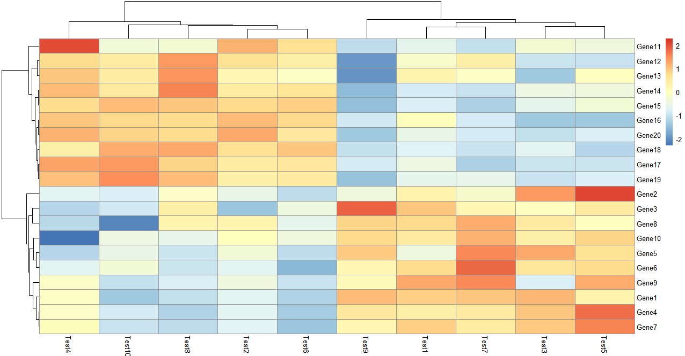

- 颜色设置

可以看一下这个`colorRampPalette`取了50个色来标注数据之间的关系和区别

`colorRampPalette`的数值设置的越大，颜色越多样，数据差距就能越清晰的反应出来

```R
> pheatmap(test, color = colorRampPalette(c("navy", "white", "firebrick3"))(50))
> colorRampPalette(c("navy", "white", "firebrick3"))(50)
 [1] "#000080" "#0A0A85" "#14148A" "#1F1F8F" "#292994" "#343499" "#3E3E9F" "#4848A4" "#5353A9"
[10] "#5D5DAE" "#6868B3" "#7272B9" "#7C7CBE" "#8787C3" "#9191C8" "#9C9CCD" "#A6A6D2" "#B0B0D8"
[19] "#BBBBDD" "#C5C5E2" "#D0D0E7" "#DADAEC" "#E4E4F2" "#EFEFF7" "#F9F9FC" "#FDFAFA" "#FBF1F1"
[28] "#F9E8E8" "#F7E0E0" "#F5D7D7" "#F3CECE" "#F1C5C5" "#EFBCBC" "#EDB3B3" "#EBAAAA" "#E9A2A2"
[37] "#E79999" "#E59090" "#E38787" "#E17E7E" "#DF7575" "#DD6C6C" "#DB6464" "#D95B5B" "#D75252"
[46] "#D54949" "#D34040" "#D13737" "#CF2E2E" "#CD2626"
```


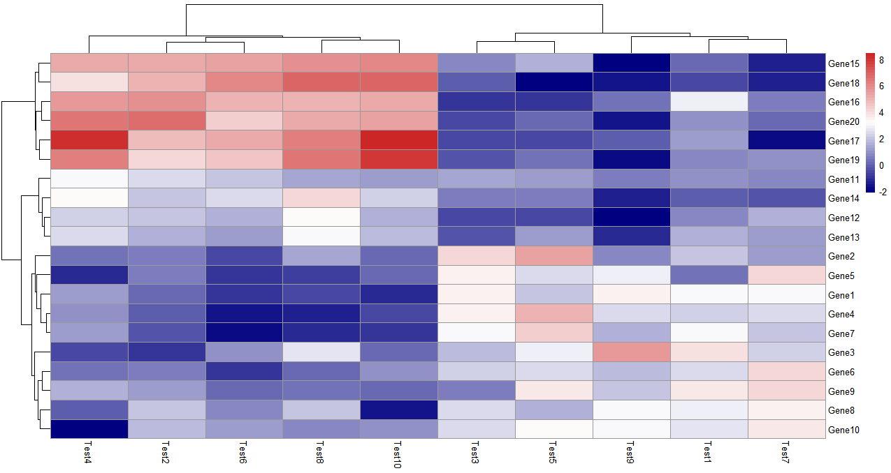


- 层次聚类方式

```
> pheatmap(test,clustering_method = "ward")
```

`clustering_method`可选的参数包含`'ward', 'ward.D', 'ward.D2', 'single', 'complete', 'average', 'mcquitty', 'median' or 'centroid'`，这些都是层次聚类里面类间距离的计算方法。


- `legend = FALSE`


```R
> pheatmap(test, cluster_row = FALSE, legend_breaks = -1:4, legend_labels = c("0",
                                                                            "1e-4", "1e-3", "1e-2", "1e-1", "1"))

```

这里自定义设置`legend`范围在-1到4之间，标签设置成这6个数，可以把自己想看的范围设置在某种颜色区间，一目了然。

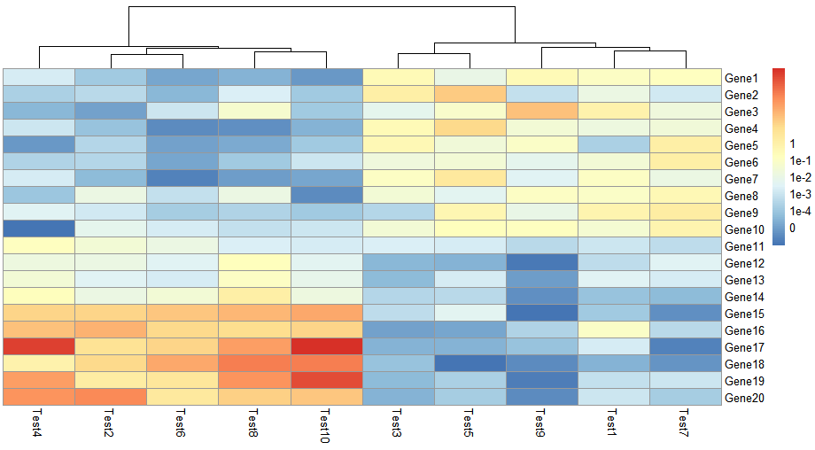


- 色块内部信息

```R
> pheatmap(test, display_numbers = TRUE)
> pheatmap(test, display_numbers = TRUE, number_format = "%.1e")
```

显示矩阵信息，数值很大很小的时候可以添加参数设置 `number_format = "%.1e"`， 以科学计数法显示内容

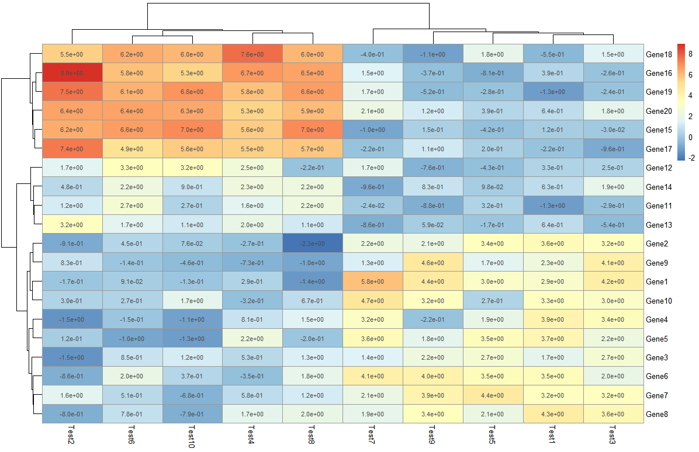


```R
> pheatmap(test, display_numbers = matrix(ifelse(test > 5, "*", ""), nrow(test)))
```

在这里对原来的矩阵进行处理，构建了新的矩阵存储标记情况，大于5的标记上 *****，如果是使用相关系数做的热图，可以采用这种方式添加显著性标记。


- 设置热图以及字体大小和标题内容

```R
> pheatmap(test, cellwidth = 15, cellheight = 12, fontsize = 8, main = "Example heatmap", filename = "test.pdf")
```

`cellwidth`设置热图长，`cellheight`设置热图高，`main`设置主题，`fontsize`设置所有的字体，`filename`设置热图


#### 5. 对热图注释

- 创建行列的注释信息

```R
> # Generate annotations for rows and columns
> annotation_col = data.frame(
+   CellType = factor(rep(c("CT1", "CT2"), 5)), 
+   Time = 1:5
+ )
> rownames(annotation_col) = paste("Test", 1:10, sep = "")
> annotation_row = data.frame(
+   GeneClass = factor(rep(c("Path1", "Path2", "Path3"), c(10, 4, 6)))
+ )
> rownames(annotation_row) = paste("Gene", 1:20, sep = "")
> annotation_col
       CellType Time
Test1       CT1    1
Test2       CT2    2
Test3       CT1    3
Test4       CT2    4
Test5       CT1    5
Test6       CT2    1
Test7       CT1    2
Test8       CT2    3
Test9       CT1    4
Test10      CT2    5
> annotation_row
       GeneClass
Gene1      Path1
Gene2      Path1
Gene3      Path1
Gene4      Path1
Gene5      Path1
Gene6      Path1
Gene7      Path1
Gene8      Path1
Gene9      Path1
Gene10     Path1
Gene11     Path2
Gene12     Path2
Gene13     Path2
Gene14     Path2
Gene15     Path3
Gene16     Path3
Gene17     Path3
Gene18     Path3
Gene19     Path3
Gene20     Path3
```


- 针对注释信息画热图

```R
> # Display row and color annotations
> pheatmap(test, annotation_col = annotation_col, annotation_row = annotation_row)
```

通过增加的色块另外显示额外的信息，可以分别对行列进行注释，另外注释的色条可以取消`annotation_legend = FALSE`，不过这样就不清楚颜色代表的具体含义了。


- 对注释信息色块改变配色

```R
> pheatmap(test, annotation_col = annotation_col, annotation_row = annotation_row, 
+          annotation_colors = ann_colors)
```

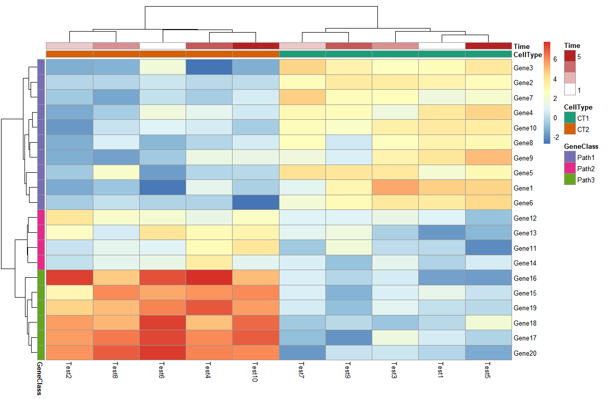

- 把热图分块

```R
> pheatmap(test, annotation_col = annotation_col, cluster_rows = FALSE, gaps_row = c(10, 14), 
+          cutree_col = 2)
```

`gaps_row` 对行进行分割，`c(10,14)`即以10和14为分割线，把行分成3部分

`cutree_col` 对列进行分割，2即分割成两块


- 改变热图行列名

可以创建新的向量存储想要设置的行列名，传给`label_row`这个参数

```R
> labels_row = c("", "", "", "", "", "", "", "", "", "", "", "", "", "", "", 
+                "", "", "Il10", "Il15", "Il1b")
> pheatmap(test, annotation_col = annotation_col, labels_row = labels_row)
```

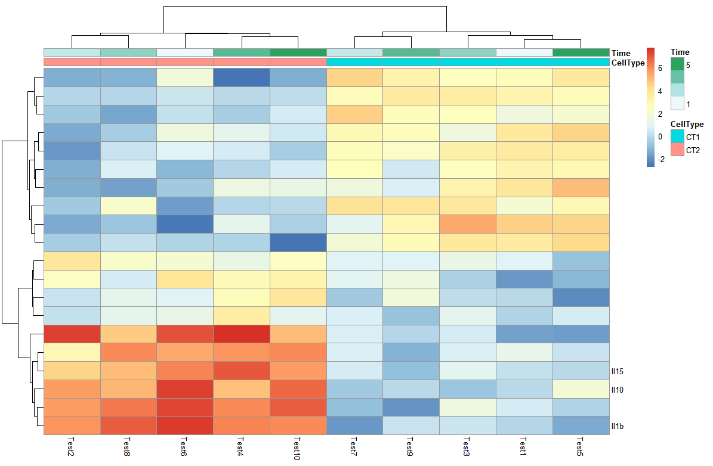

- 热图排序

```R
> callback = function(hc, mat){
+   sv = svd(t(mat))$v[,1]
+   dend = reorder(as.dendrogram(hc), wts = sv)
+   as.hclust(dend)
+ }
> pheatmap(test, clustering_callback = callback)
```


#### 解决问题1：色块控制

很多情况下，我们需要直观的通过颜色去看，当数据呈现正负值范围内时，理想情况是以0为白色，另外两个色系分别代表正值和负值，一眼看上去容易读图。

以test之间的相关系数矩阵为例，查看一下取值范围：

```R
> library(Hmisc)
> cortest <- rcorr(as.matrix(test), type = "pearson")
> r_value <- cortest$r
> range(r_value)
[1] -0.8980495  1.0000000
```

设置色块（是通过对称性将0设置为白色）

```R
> pheatmap(r_value,
+          color = c(colorRampPalette(c("blue","white"))(10),
+                    colorRampPalette(c("white","red"))(10)),
+          legend_breaks=seq(-1,1,0.2))
```

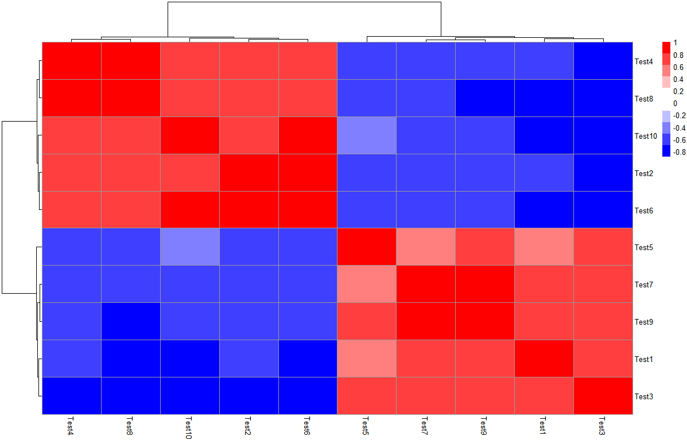


#### 解决问题2：显示部分热图

`pheatmap`这个包使用的数据形式是矩阵，在变量内部进行相关分析时，有一半数据冗余，但是矩阵形式只能通过`test[upper.tri(test)] <- NA`将冗余信息变成0，并不能够直接去除，似乎参数里也没有可以直接画上下三角热图的参数，还是可以画出上下三角的热图。

【若使用ggplot2进行热图绘制，由于其输入数据为长数据，可以通过reshape包中的melt()将数据转化，进行绘制】

```R
> r_value[upper.tri(r_value)] <- 0  
> pheatmap(r_value, 
         c(colorRampPalette(c("blue","white"))(5),
          colorRampPalette(c("white","red"))(5)),
         legend_breaks=seq(-1,1,0.2),
         cluster_rows=F, cluster_cols=F, border_color=NA)
```

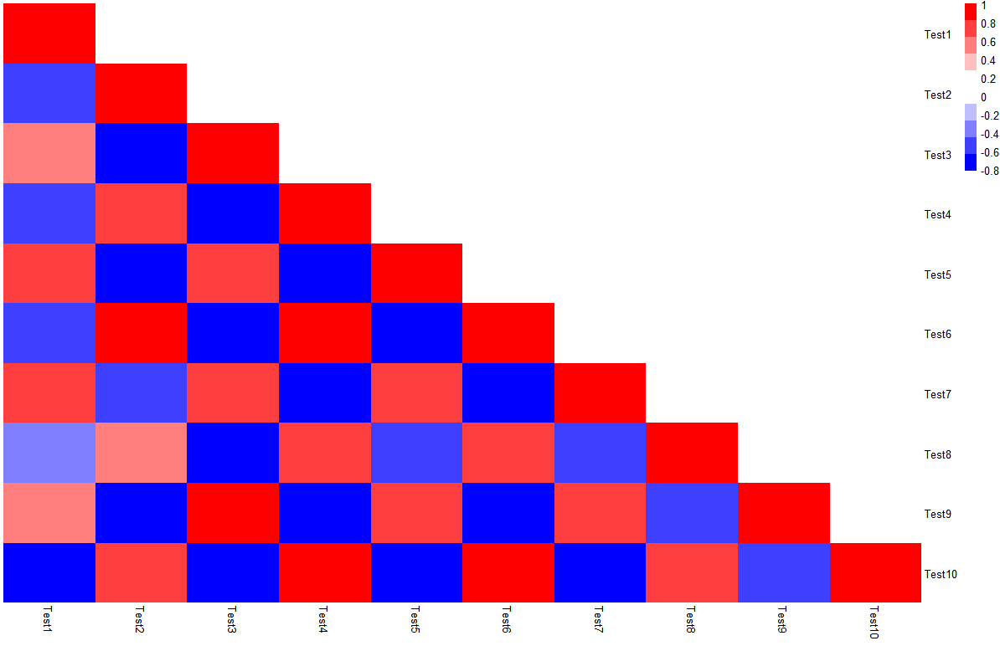

但是这样有一个大BUG，就是数据本身还是存在的，而且要把去掉的三角矩阵部分变成白色色块对应的值。


#### 解决问题3：标记相关系数热图显著性

这里引入一个计算相关矩阵的包`Hmisc`，可以计算相关性矩阵，随后直接用相关矩阵进行热图绘制，再根据`display_numbers`参数进行显著性标注。

假设现在我想看这10个test之间相关关系热图：

```R
> library(Hmisc)
> cortest <- rcorr(as.matrix(test), type = "pearson")
> p_value <- ifelse(is.na(cortest$P), "", cortest$P)
> pheatmap(cortest$r, display_numbers = matrix(ifelse(p_value < 0.05, "*", ""), nrow(p_value)))
```

做相关的`type`可以选择`spearman`

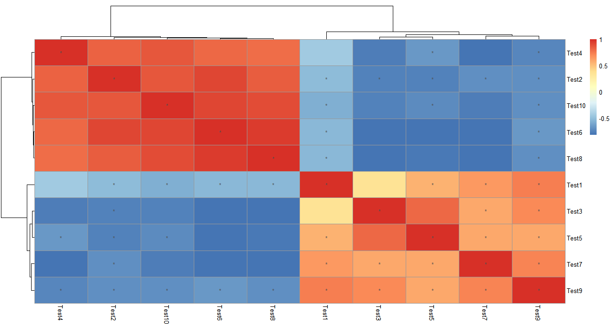

同样的，如果想看这20个基因之间的相关关系热图，可以讲数据框进行转置`t()`，因为该计算相关矩阵的函数默认对列的变量进行相关分析。

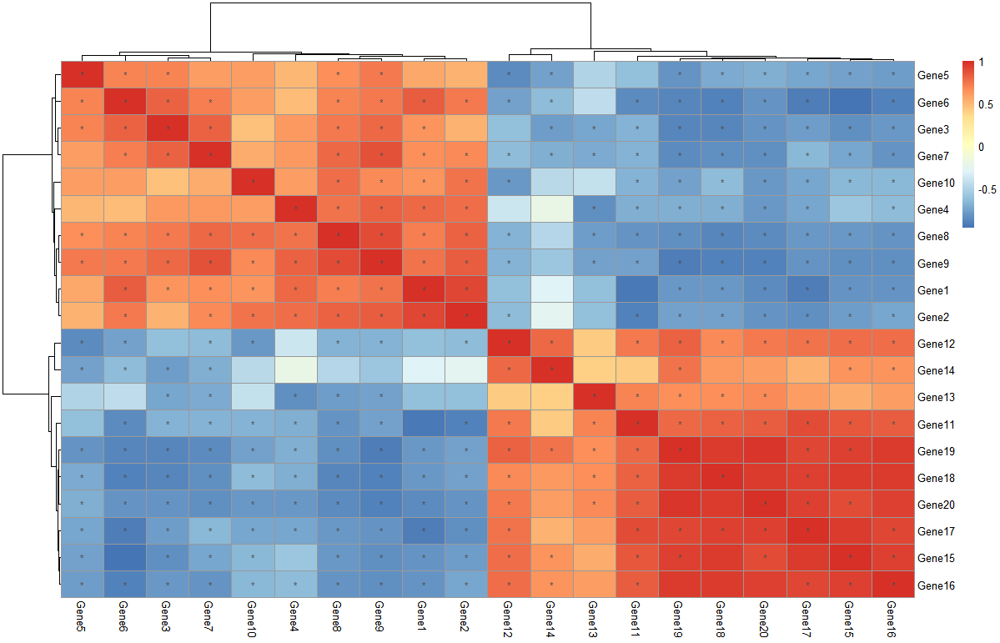


#### 解决问题4：取对数


```R
> pheatmap(log10(test))
```


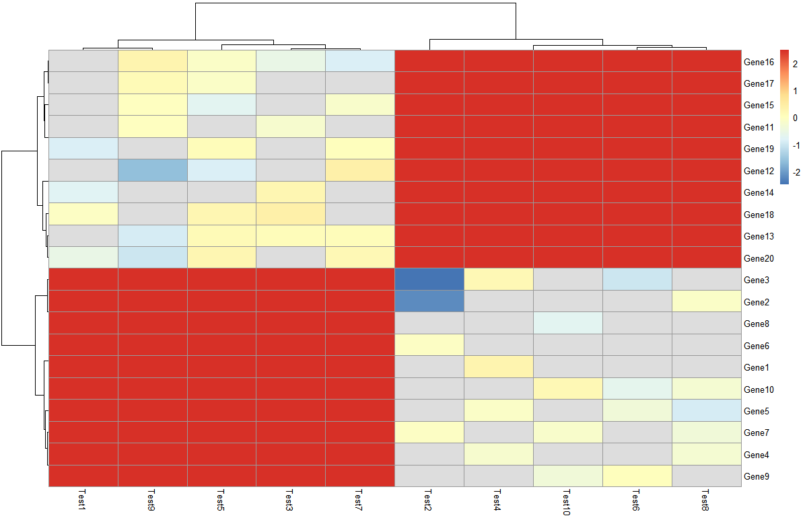


#### 解决问题5：配色

```R
> library("RColorBrewer")
> display.brewer.all()
> brewer.pal.info
         maxcolors category colorblind
BrBG            11      div       TRUE
PiYG            11      div       TRUE
PRGn            11      div       TRUE
PuOr            11      div       TRUE
RdBu            11      div       TRUE
RdGy            11      div      FALSE
RdYlBu          11      div       TRUE
RdYlGn          11      div      FALSE
Spectral        11      div      FALSE
Accent           8     qual      FALSE
Dark2            8     qual       TRUE
Paired          12     qual       TRUE
Pastel1          9     qual      FALSE
Pastel2          8     qual      FALSE
Set1             9     qual      FALSE
Set2             8     qual       TRUE
Set3            12     qual      FALSE
Blues            9      seq       TRUE
BuGn             9      seq       TRUE
BuPu             9      seq       TRUE
GnBu             9      seq       TRUE
Greens           9      seq       TRUE
Greys            9      seq       TRUE
Oranges          9      seq       TRUE
OrRd             9      seq       TRUE
PuBu             9      seq       TRUE
PuBuGn           9      seq       TRUE
PuRd             9      seq       TRUE
Purples          9      seq       TRUE
RdPu             9      seq       TRUE
Reds             9      seq       TRUE
YlGn             9      seq       TRUE
YlGnBu           9      seq       TRUE
YlOrBr           9      seq       TRUE
YlOrRd           9      seq       TRUE
```


查看具体颜色

```R
> display.brewer.pal(n = 9, name = 'YlOrBr')
```

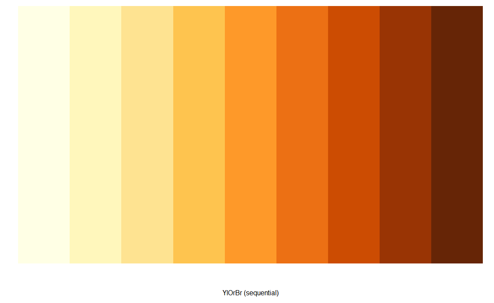

#### 补充

- ComplexHeatmap提供一个新功能，把pheatmap直接转成ComplexHeatmap

source：https://jokergoo.github.io/2020/05/06/translate-from-pheatmap-to-complexheatmap/


- 使用corrplot包去做相关性热图也是一个很好的选择。