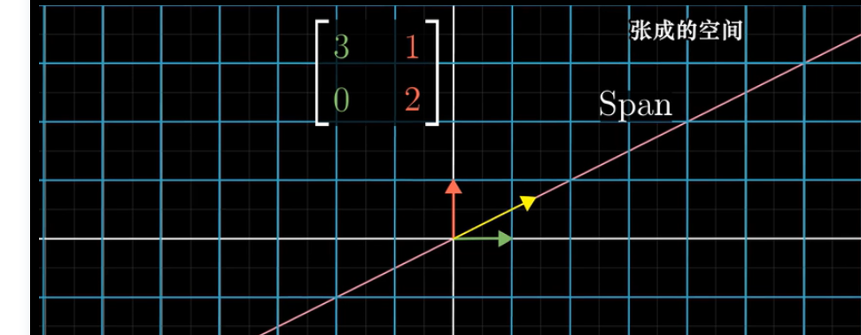
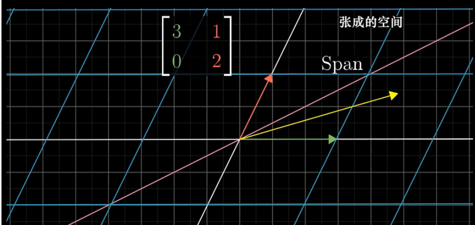
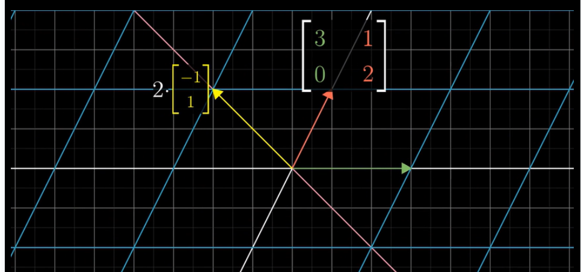
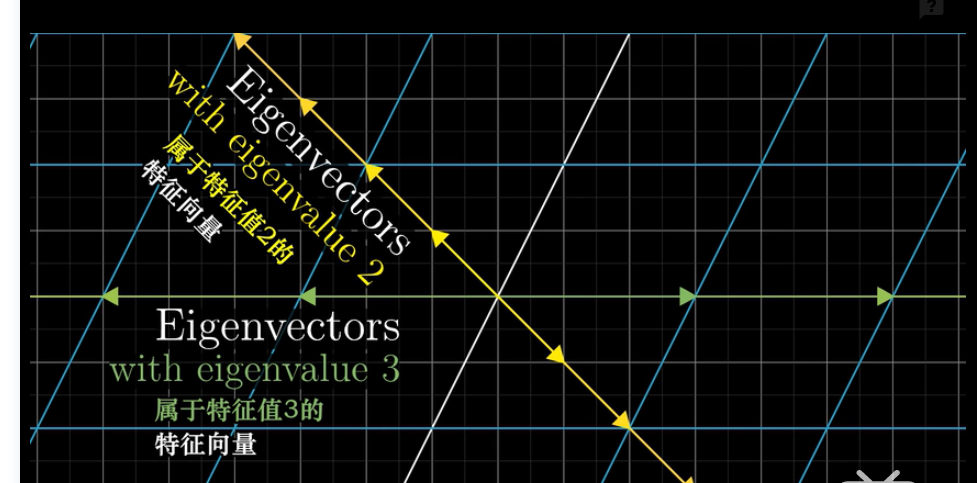

  

## 奇异值分解

​     奇异值分解(Singular Value Decomposition，以下简称SVD)是在机器学习领域广泛应用的算法，它不光可以用于降维算法中的特征分解，还可以用于推荐系统，以及自然语言处理等领域。是很多机器学习算法的基石。奇异值分解是一个有着很明显的物理意义的一种方法，它可以将一个比较复杂的矩阵用更小更简单的几个子矩阵的相乘来表示，这些小矩阵描述的是矩阵的重要的特性。

### 矩阵特征值和特征向量

[参考1](https://zhuanlan.zhihu.com/p/26306568)

[参考2](https://zhuanlan.zhihu.com/p/34281291)

[参考3](https://www.cnblogs.com/bigmonkey/p/10180997.html)

​     A为n阶矩阵，若数λ和n维非0列向量 x 满足 Ax=λx，那么数λ称为A的**特征值**，x称为A的对应于特征值λ的**特征向量**。式Ax=λx也可写成( A-λE)x=0，并且|λE-A|叫做A 的**特征多项式**。（E 、I是主队角元素全为1，其余全为零的单位矩阵）当特征多项式等于0的时候，称为A的特征方程，特征方程是一个齐次线性方程组，求解特征值的过程其实就是求解特征方程的解。

**How to find** ![[公式]](https://www.zhihu.com/equation?tex=x) : ![[公式]](https://www.zhihu.com/equation?tex=Ax%3D%5Clambda+x%5CLeftrightarrow+%28A-%5Clambda+I%29x%3D0+)

注意到 ![[公式]](https://www.zhihu.com/equation?tex=A-%5Clambda+I) 是一个方阵，所以 ![[公式]](https://www.zhihu.com/equation?tex=%28A-%5Clambda+I%29x%3D0+%5Ctag%7B4%2A%7D) 在 ![[公式]](https://www.zhihu.com/equation?tex=det%28A-%5Clambda+I+%29%3D0) 时有非零解，这些非零解便是 ![[公式]](https://www.zhihu.com/equation?tex=A) 的特征向量。现在看一个例题。由 **![[公式]](https://www.zhihu.com/equation?tex=det%28A-%5Clambda+I+%29%3D0) 可列出关于 ![[公式]](https://www.zhihu.com/equation?tex=%5Clambda) 的方程，这个方程被称为 ![[公式]](https://www.zhihu.com/equation?tex=A) 的特征方程。**

来看一个简单的示例

　
　　先求解A的特征值：

　　A的迹是所有特征值之和，它等于主对角线元素之和，这可以用来作为特征值求解的初步验证。接下来求解每个特征值对应的特征向量：

　　容易判断零空间的基是：

　　这也是特征值λ1对应的特征向量，实际上零空间中的所有向量都是λ1对应的特征向量。

　　用同样的方法求出λ2对应的特征向量：

#### 特征值特征向量的空间变化

[参考](https://www.bilibili.com/video/av6540378/?rt=V%2FymTlOu4ow%2Fy4xxNWPUZze2pXNrPynQBLR9XPZDE7k%3D)

考虑基向量的线性变换，如下图所示在基向量变换的过程中，向量位置变换到坐标（3，0），（1，2）。

在变换的过程中，关注对向量的作用，并且考虑向量的张成空间，在变换的过程中，大部分向量离开其张成空间。

​                                           

但是某些向量留在其张成空间里，意味着矩阵的变换对其仅仅是拉伸或者压缩而已。如下图所示的（-1，1）向量就是在变换的过程中留在其张成空间里。那么（-1，1）便是特征值为2的特征向量。基向量中的x轴同样在变换的过程中也留在其张成空间里，基向量（1，0）是特征值为3的特征向量。
                                                                                   
    
                                     

### 对角化分解

给定一个大小为![[公式]](https://www.zhihu.com/equation?tex=m%5Ctimes+m)的矩阵![[公式]](https://www.zhihu.com/equation?tex=A)（是方阵），其对角化分解可以写成

![[公式]](https://www.zhihu.com/equation?tex=A%3DU%5CLambda+U%5E%7B-1%7D)

其中，![[公式]](https://www.zhihu.com/equation?tex=U)的每一列都是特征向量，![[公式]](https://www.zhihu.com/equation?tex=%5CLambda)对角线上的元素是从大到小排列的特征值，若将![[公式]](https://www.zhihu.com/equation?tex=U)记作![[公式]](https://www.zhihu.com/equation?tex=U%3D%5Cleft%28+%5Cvec%7Bu%7D_1%2C%5Cvec%7Bu%7D_2%2C...%2C%5Cvec%7Bu%7D_m+%5Cright%29+)，则

![[公式]](https://www.zhihu.com/equation?tex=AU%3DA%5Cleft%28%5Cvec%7Bu%7D_1%2C%5Cvec%7Bu%7D_2%2C...%2C%5Cvec%7Bu%7D_m%5Cright%29%3D%5Cleft%28%5Clambda_1+%5Cvec%7Bu%7D_1%2C%5Clambda_2+%5Cvec%7Bu%7D_2%2C...%2C%5Clambda_m+%5Cvec%7Bu%7D_m%5Cright%29)

![[公式]](https://www.zhihu.com/equation?tex=%3D%5Cleft%28%5Cvec%7Bu%7D_1%2C%5Cvec%7Bu%7D_2%2C...%2C%5Cvec%7Bu%7D_m%5Cright%29+%5Cleft%5B+%5Cbegin%7Barray%7D%7Bccc%7D+%5Clambda_1+%26+%5Ccdots+%26+0+%5C%5C+%5Cvdots+%26+%5Cddots+%26+%5Cvdots+%5C%5C+0+%26+%5Ccdots+%26+%5Clambda_m+%5C%5C+%5Cend%7Barray%7D+%5Cright%5D)

![[公式]](https://www.zhihu.com/equation?tex=%5CRightarrow+AU%3DU%5CLambda+%5CRightarrow+A%3DU%5CLambda+U%5E%7B-1%7D)

更为特殊的是，当矩阵![[公式]](https://www.zhihu.com/equation?tex=A)是一个对称矩阵时，则存在一个对称对角化分解，即

![[公式]](https://www.zhihu.com/equation?tex=A%3DQ%5CLambda+Q%5ET)

其中，![[公式]](https://www.zhihu.com/equation?tex=Q)的每一列都是相互正交的特征向量，且是单位向量，![[公式]](https://www.zhihu.com/equation?tex=%5CLambda)对角线上的元素是从大到小排列的特征值。

当然，将矩阵![[公式]](https://www.zhihu.com/equation?tex=Q)记作![[公式]](https://www.zhihu.com/equation?tex=Q%3D%5Cleft%28%5Cvec%7Bq%7D_1%2C%5Cvec%7Bq%7D_2%2C...%2C%5Cvec%7Bq%7D_m%5Cright%29)，则矩阵![[公式]](https://www.zhihu.com/equation?tex=A)也可以写成如下形式：

![[公式]](https://www.zhihu.com/equation?tex=A%3D%5Clambda_1+%5Cvec%7Bq%7D_1%5Cvec%7Bq%7D_1%5ET%2B%5Clambda_2+%5Cvec%7Bq%7D_2%5Cvec%7Bq%7D_2%5ET%2B...%2B%5Clambda_m+%5Cvec%7Bq%7D_m%5Cvec%7Bq%7D_m%5ET)

举一个简单的例子，如给定一个大小为![[公式]](https://www.zhihu.com/equation?tex=2%5Ctimes+2)的矩阵![[公式]](https://www.zhihu.com/equation?tex=A%3D%5Cleft%5B+%5Cbegin%7Barray%7D%7Bcc%7D+2+%26+1+%5C%5C+1+%26+2+%5C%5C+%5Cend%7Barray%7D+%5Cright%5D)，根据![[公式]](https://www.zhihu.com/equation?tex=%5Cleft%7C%5Clambda+I-A%5Cright%7C%3D%5Cleft%7C+%5Cbegin%7Barray%7D%7Bcc%7D+%5Clambda-2+%26+-1+%5C%5C+-1+%26+%5Clambda-2+%5C%5C+%5Cend%7Barray%7D+%5Cright%7C%3D0)求得特征值为![[公式]](https://www.zhihu.com/equation?tex=%5Clambda_1%3D3)，![[公式]](https://www.zhihu.com/equation?tex=%5Clambda_2%3D1)，相应地，![[公式]](https://www.zhihu.com/equation?tex=%5Cvec%7Bq%7D_1%3D%5Cleft%28%5Cfrac%7B%5Csqrt%7B2%7D%7D%7B2%7D%2C+%5Cfrac%7B%5Csqrt%7B2%7D%7D%7B2%7D%5Cright%29%5ET)，![[公式]](https://www.zhihu.com/equation?tex=%5Cvec%7Bq%7D_2%3D%5Cleft%28-%5Cfrac%7B%5Csqrt%7B2%7D%7D%7B2%7D%2C+%5Cfrac%7B%5Csqrt%7B2%7D%7D%7B2%7D%5Cright%29%5ET)，则

![[公式]](https://www.zhihu.com/equation?tex=A%3D%5Clambda_1+%5Cvec%7Bq%7D_1%5Cvec%7Bq%7D_1%5ET%2B%5Clambda_2+%5Cvec%7Bq%7D_2%5Cvec%7Bq%7D_2%5ET+%3D%5Cleft%5B+%5Cbegin%7Barray%7D%7Bcc%7D+2+%26+1+%5C%5C+1+%26+2+%5C%5C+%5Cend%7Barray%7D+%5Cright%5D).
这样，我们就很容易地得到了矩阵![[公式]](https://www.zhihu.com/equation?tex=A)的对称对角化分解。

##### 上面所讲的矩阵进行特征分解，矩阵A必须为方阵。那么如果A不是方阵，即行和列不相同的矩阵进行分解时就是所说的奇异值分解了。

#### 奇异值分解

[参考](https://www.cnblogs.com/pinard/p/6251584.html)

SVD也是对矩阵进行分解，但是和特征分解不同，SVD并不要求要分解的矩阵为方阵。假设我们的矩阵A是一个m×n的矩阵，那么我们定义矩阵A的SVD为：

​                                                                                     A=UΣVT

其中U是一个m×m的矩阵，Σ是一个m×n的矩阵，除了主对角线上的元素以外全为0，主对角线上的每个元素都称为奇异值，V是一个n×n的矩阵。U和V都是酉矩阵，即满足UTU=I,VTV=I。下图可以很形象的看出上面SVD的定义：

1.那么我们如何求出SVD分解后的U,Σ,V这三个矩阵呢？

​    如果我们将A的转置和A做矩阵乘法，那么会得到n×n的一个方阵ATA。既然ATA是方阵，那么我们就可以      进行特征分解，得到的特征值和特征向量满足下式：

​                                                                      (ATA)vi=λivi

　这样我们就可以得到矩阵ATA的n个特征值和对应的n个特征向量v了。将ATA的所有特征向量张成一个n×n的矩阵V，就是我们SVD公式里面的V矩阵了。一般我们将V中的每个特征向量叫做A的右奇异向量。

　如果我们将A和A的转置做矩阵乘法，那么会得到m×m的一个方阵AAT。既然AAT是方阵，那么我们就可以进行特征分解，得到的特征值和特征向量满足下式：

​                                                                      (AAT)ui=λiui

　这样我们就可以得到矩阵AAT的m个特征值和对应的m个特征向量u了。将AAT的所有特征向量张成一个m×m的矩阵U，就是我们SVD公式里面的U矩阵了。一般我们将U中的每个特征向量叫做A的左奇异向量。

　U和V我们都求出来了，现在就剩下奇异值矩阵Σ没有求出了。由于Σ除了对角线上是奇异值其他位置都是0，那我们只需要求出每个奇异值σ就可以了。

​                                            A=UΣVT⇒AV=UΣVTV⇒AV=UΣ⇒Avi=σiui⇒σi=Avi/ui

 　　这样我们可以求出我们的每个奇异值，进而求出奇异值矩阵Σ。

###### 怎么证明ATA的特征向量组成的就是我们SVD中的V矩阵，而AAT的特征向量组成的就是我们SVD中的U矩阵

​                                            A=UΣVT⇒ AT=VΣTUT⇒ATA=VΣTUTUΣVT=VΣ2VT

  　上式证明使用了:UTU=I,ΣTΣ=Σ2。可以看出ATA的特征向量组成的的确就是我们SVD中的V矩阵。类似的方法可以得到AAT的特征向量组成的就是我们SVD中的U矩阵。

　　　　进一步我们还可以看出我们的特征值矩阵等于奇异值矩阵的平方，也就是说特征值和奇异值满足如下关系：

​                                                                       σ2i=λi

##### SVD与PCA区别与联系

[参考](https://www.cnblogs.com/bjwu/p/9280492.html)

主成分分析的步骤为：

1. 设有m条n维数据，组成n×m矩阵
2. 对所有样本进行中心化
3. 计算样本的协方差矩阵
4. 对协方差矩阵进行特征值分解
5. 取最大的k个特征值所对应的特征向量构成矩阵P
6. Y=PX 即为降维到k维后的数据

**1.1 从目的上来说：**

SVD是一种矩阵分解方法，相当于因式分解，他的目的纯粹就是将一个矩阵拆分成多个矩阵相乘的形式。

PCA从名字上就很直观，找到矩阵的主成分，也就意味这从一出生这就是个降维的方法。

**1.2 从方法上来说：**

PCA在过程中要计算协方差矩阵，当样本数和特征数很多的时候，这个计算量是相当大的。

注意到SVD也可以得到协方差矩阵 ATA最大的k个特征向量张成的矩阵，但是SVD有个好处，有一些SVD的实现算法可以不先求出协方差矩阵ATA，也能求出我们的右奇异矩阵V。也就是说，我们的PCA算法可以不用做特征分解，而是做SVD来完成。

另一方面，A的奇异值分解迭代计算比协方差矩阵的特征值分解更快更准确。

注意到PCA仅仅使用了SVD的右奇异矩阵V，没有使用左奇异矩阵U，那么左奇异矩阵有什么用呢？

假设我们的样本是m✖n的矩阵X，如果我们通过SVD找到了矩阵 ATA的最大的d个特征向量组成的m✖d维矩阵U，则我们进行如下处理：

X′d*n=UTd×mXm×n

可以得到一个d✖n的矩阵X'，且这个矩阵和我们原来的m✖n维的样本矩阵X相比，行数从m剪到了d，可见对行数进行了压缩。

> 也就是说，左奇异矩阵可以用于行数的压缩。相对的，右奇异矩阵可以用于列数即特征维度的压缩，也就是我们的PCA降维。

换句话说，SVD可以获取另一个方向上的主成分，而PCA只能获得单个方向上的主成分。这一点在NLP的文本处理上得到了很大体现。

