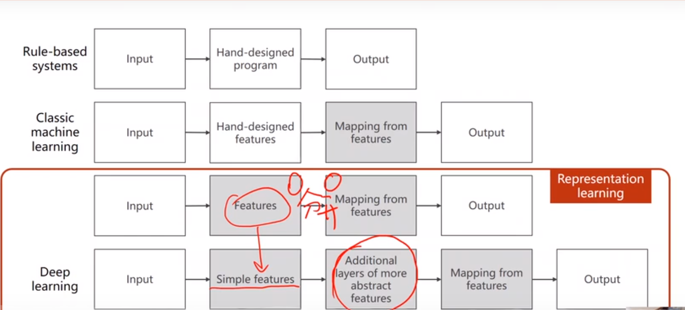

# 用 Pytorch 构建神经网络 overview
#### 参考
刘二大人pytorch深度学习实践

[零基础入门深度学习](https://www.zybuluo.com/hanbingtao/note/433855)

#### 学习目标
1.用pytorch如何来实现一个学习系统
2.理解基本的神经网络以及深度学习
3.python
4.线性代数概率论

#### 机器学习
1.人工智能：简单的来说就是用算法代替大脑，比如说你中午要吃什么，那么很多店铺都会有很多推送，他们的这个推送就是根据客户经常定的饭来确定的。

2.机器学习：用算法推断可能发生的事情，一般来说常用的都是监督学习，监督学习用一组包含label的数据集，通过建立模型用数据进行训练。

3.算法设计思维方式：穷举法、贪心法、分治法、动态规划
4.主流的15种机器学习的算法：
4.1监督学习： 线性回归、逻辑回归、线性判别分析、决策树、朴素贝叶斯、K临近算法、学习向量量化、支持向量机、随机森林等
4.2无监督学习：高斯混合模型、限制玻尔兹曼机、K-means聚类等

5.深度学习仅仅是机器学习的一部分只是算法使用的是人工网络

简单来说深度学习是机器学习的一个分支，机器学习是人工智能的一个分支
#### 开发学习系统的历史过程
1.基于规则的系统（rule-based systems)
拿到的输入，手动的设置程序，得到输出

2.经典的机器学习的方法（classic machine learning)
输入数据，手动提取特征，将提取的特征与数据建立一个关系，把特征映射到数据上，得到输出
3.表示学习（representation learning)
特征的提取可以学习出来而不是手动提取，传统的机器学习的做法是人为地设计特征或者说使用已经完全标记好的数据来试图接近最好的分类效果。但实际上很多未标记的或者说标记相对较少的训练数据，我们当然可以人为标记，但也可以自动地筛选出比较重要的特征，有点类似于PCA(主成分分析)的思路，这就是表示学习或者说特征学习。
4.深度学习（deepling learning)
用简单的特征，原始的特征，比如是个图片就用图片的像素值作为输入数据，如果是个语音就把波长拿进来等，有些数值需要进行变换。设置额外的层用来提取特征，那么神经网络就可以实现这个任务。和传统的表示学习的方法的区别，传统的学习feature 与学习器是分开进行的，因为没有标签所以用的是无监督学习的方法去进行feature的提取；但是深度学习特征与学习其是统一的。

##########################
2000年之前呢最火的学习器是SVM，因为SVM的一些限制开始使用神经网络。
#### 传统的机器学习的策略：
scikit—learn 算法进行模型选择的过程

SVM的挑战：
人工特征的提取的限制
对于大数据集工作不是很好
越来越多的无结构的数据的应用
#### 神经网络的简单介绍
神经网络是在机器学习和认知科学领域，是一种模仿生物神经网络（动物的中枢神经系统，特别是大脑）的结构和功能的数学模型或计算模型。
**神经元**是神经网络中最基本的结构，也可以说是神经网络的基本单元，它的设计灵感完全来源于生物学上神经元的信息传播机制。

神经元也是**感知器**（perceptron），一个感知器包含三个部分：输入层，激活函数，输出层。

输入权值 一个感知器可以接收多个输入x，每个输入上有一个权值w，此外还有一个偏置项b.

激活函数 感知器的激活函数可以有很多选择，比如我们可以选择下面这个**阶跃函数**f来作为激活函数：

$$
f(z)=\begin{cases} {1}，z>0\\ {0}， oteherwise\end{cases}  
$$
输出 感知器的输出由下面这个公式来计算

$$
y=f(w*x+b)
$$

下面我们用一个简单的例子来帮助理解。

例子：用感知器实现`and`函数

我们设计一个感知器，让它来实现`and`运算。程序员都知道，`and`是一个二元函数（带有两个参数和），下面是它的**真值表**：

| x1   | x2   | y    |
| :--- | :--- | :--- |
| 0    | 0    | 0    |
| 0    | 1    | 0    |
| 1    | 0    | 0    |
| 1    | 1    | 1    |

为了计算方便，我们用0表示**false**，用1表示**true**。

我们令w1=0.5,w2=0.5,b=-0.8，而激活函数就是前面写出来的**阶跃函数**，这时，感知器就相当于`and`函数。下面我们计算一下：

输入真值表中的第一行x1=0,x2=0,那么根据公式：
$$
y=f(w*x+b)=f(w1x1+w2x2+b)=f(0.5*0+0.5*0-0.8)=f(-0.8)=0
$$
也就是当都为x1x2都为0的时候，y为0，这就是**真值表**的第一行。

**感知器**不仅仅能实现简单的布尔运算。它可以拟合任何的线性函数，任何**线性分类**或**线性回归**问题都可以用感知器来解决。前面的布尔运算可以看作是**二分类**问题，即给定一个输入，输出0（属于分类0）或1（属于分类1）。

对于**神经元**来说激活函数往往选择为sigmoid函数或tanh函数

计算一个神经元的输出的方法和计算一个感知器的输出是一样的。
$$
设神经元的输入是向量\vec{x}，权重向量是\vec{w}(偏置项是\vec{w0})，激活函数是sigmoid函数，则其输出：
$$

$$
y=sigmoid(\vec{w}^T*\vec{x})
$$

sigmoid函数的定义如下：
$$
sigmoid(x)=\frac{1}{1+e^-x}
$$

将其带入前面的式子，得到
$$
sigmoid(x)=\frac{1}{1+e^-\vec{w}^T*\vec{x}}
$$
sigmoid函数是一个非线性函数，值域是(0,1)。函数图像如下图所示

**神经网络**就是把多层的神经元连接起来，可以一层一层级联。输入向量连到许多神经元上，这些神经元的输出又连到一堆神经元上，这一过程可以重复很多次。
神经网络其实就是按照**一定规则**连接起来的多个**神经元**。

- 神经元按照**层**来布局。最左边的层叫做**输入层**，负责接收输入数据；最右边的层叫**输出层**，我们可以从这层获取神经网络输出数据。输入层和输出层之间的层叫做**隐藏层**，因为它们对于外部来说是不可见的。
- 同一层的神经元之间没有连接。
- 第N层的每个神经元和第N-1层的**所有**神经元相连(这就是full connected的含义)，第N-1层神经元的输出就是第N层神经元的输入。
- 每个连接都有一个**权值**。

上面这些规则定义了全连接神经网络的结构。事实上还存在很多其它结构的神经网络，比如卷积神经网络(CNN)、循环神经网络(RNN)，他们都具有不同的连接规则。

**反向传播算法**

神经网络的最重要的算法是back propagation(反向传播),反向传播的过程就是求偏导数。反向传播的核心是计算图。

> 作者：Anonymous
> 链接：https://www.zhihu.com/question/27239198/answer/89853077
> 来源：知乎
>

我们以求e=(a+b)*(b+1)的偏导为例。
它的复合关系画出图可以表示如下：

在图中，引入了中间变量c,d。

为了求出a=2, b=1时，e的梯度，我们可以先利用偏导数的定义求出不同层之间相邻节点的偏导关系，如下图所示。

利用链式法则我们知道：
![[公式]](https://www.zhihu.com/equation?tex=%5Cfrac%7B%5Cpartial+e%7D%7B%5Cpartial+a%7D%3D%5Cfrac%7B%5Cpartial+e%7D%7B%5Cpartial+c%7D%5Ccdot+%5Cfrac%7B%5Cpartial+c%7D%7B%5Cpartial+a%7D)以及![[公式]](https://www.zhihu.com/equation?tex=%5Cfrac%7B%5Cpartial+e%7D%7B%5Cpartial+b%7D%3D%5Cfrac%7B%5Cpartial+e%7D%7B%5Cpartial+c%7D%5Ccdot+%5Cfrac%7B%5Cpartial+c%7D%7B%5Cpartial+b%7D%2B%5Cfrac%7B%5Cpartial+e%7D%7B%5Cpartial+d%7D%5Ccdot+%5Cfrac%7B%5Cpartial+d%7D%7B%5Cpartial+b%7D)。

链式法则在上图中的意义是什么呢？其实不难发现，![[公式]](https://www.zhihu.com/equation?tex=%5Cfrac%7B%5Cpartial+e%7D%7B%5Cpartial+a%7D)的值等于从a到e的路径上的偏导值的乘积，而![[公式]](https://www.zhihu.com/equation?tex=%5Cfrac%7B%5Cpartial+e%7D%7B%5Cpartial+b%7D)的值等于从b到e的路径1(b-c-e)上的偏导值的乘积加上路径2(b-d-e)上的偏导值的乘积。也就是说，对于上层节点p和下层节点q，要求得![[公式]](https://www.zhihu.com/equation?tex=%5Cfrac%7B%5Cpartial+p%7D%7B%5Cpartial+q%7D)，需要找到从q节点到p节点的所有路径，并且对每条路径，求得该路径上的所有偏导数之乘积，然后将所有路径的 “乘积” 累加起来才能得到![[公式]](https://www.zhihu.com/equation?tex=%5Cfrac%7B%5Cpartial+p%7D%7B%5Cpartial+q%7D)的值。

大家也许已经注意到，这样做是十分冗余的，因为很多**路径被重复访问了**。比如上图中，a-c-e和b-c-e就都走了路径c-e。对于权值动则数万的深度模型中的神经网络，这样的冗余所导致的计算量是相当大的。同样是利用链式法则，BP算法则机智地避开了这种冗余，它对于每一个路径只访问一次就能求顶点对所有下层节点的偏导值。正如反向传播(BP)算法的名字说的那样，BP算法是反向(自上往下)来寻找路径的。

从最上层的节点e开始，初始值为1，以层为单位进行处理。对于e的下一层的所有子节点，将1乘以e到某个节点路径上的偏导值，并将结果“堆放”在该子节点中。等e所在的层按照这样传播完毕后，第二层的每一个节点都“堆放"些值，然后我们针对每个节点，把它里面所有“堆放”的值求和，就得到了顶点e对该节点的偏导。然后将这些第二层的节点各自作为起始顶点，初始值设为顶点e对它们的偏导值，以"层"为单位重复上述传播过程，即可求出顶点e对每一层节点的偏导数。

举个不太恰当的例子，如果把上图中的箭头表示欠钱的关系，即c→e表示e欠c的钱。以a, b为例，直接计算e对它们俩的偏导相当于a, b各自去讨薪。a向c讨薪，c说e欠我钱，你向他要。于是a又跨过c去找e。b先向c讨薪，同样又转向e，b又向d讨薪，再次转向e。可以看到，追款之路，充满艰辛，而且还有重复，即a, b 都从c转向e。而BP算法就是主动还款。e把所欠之钱还给c，d。c，d收到钱，乐呵地把钱转发给了a，b，皆大欢喜。

##### 深度学习框架构建

#### pytorch

[机器学习库](https://zhuanlan.zhihu.com/p/44952874)

#### install 
[官网](https://pytorch.org/get-started/locally/#mac-installation)

conda install pytorch torchvision torchaudio cpuonly -c pytorch
安装成功后我们可以测试一下

~~~
>>> import torch
>>> import torchvision
>>> print(torch.cuda.is_available()) ###因为没有安装cuda，所以会显示false
False
~~~
